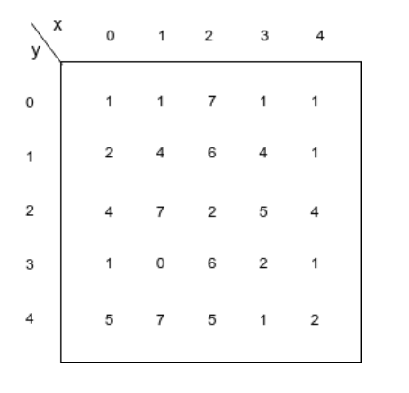
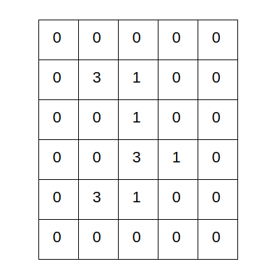
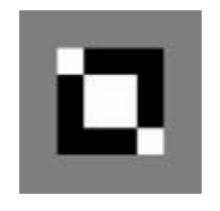
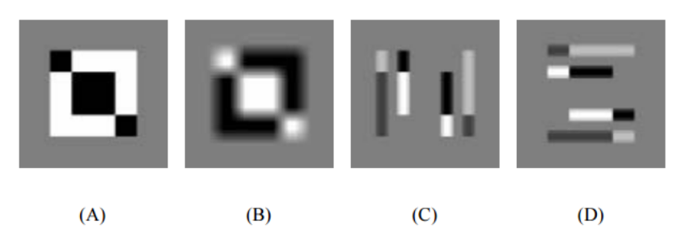

## Objectives

* 2D Convolution.
* Image Histograms.
* Histogram Equalization.
* 2D Fourier Transform.
* Image Gradients.

## Prerequisites (Before you start)

* Read [Section 3 Notes](){:target="_blank"}.
* Read [Section 4 Notes](){:target="_blank"}.

## Deadline

**Tuesday 13/3/2018 12:00 PM.**

## Required 
Each individual student is required to submit the solution of assignment problems. You can submit it as a hard-copy or scan it and send by mail providing this title (CV2018-Assignment2-[YOUR_NAME])

## Problem 1
Consider the following small image: 

$$
\begin{bmatrix}
1 & 2 & 3 & 4 & 5 & 6 & 7\\
1 & 2 & 3 & 4 & 5 & 6 & 7\\
1 & 2 & 3 & 4 & 5 & 6 & 7\\
1 & 2 & 3 & 94 & 5 & 6 & 7\\
1 & 2 & 3 & 4 & 5 & 6 & 7\\
1 & 2 & 3 & 4 & 5 & 6 & 7\\
1 & 2 & 3 & 4 & 5 & 6 & 7\\
\end{bmatrix}$$

**a)** Calculate the image that results from convolution with the following kernel: 
 
 $$ 
\begin{bmatrix}
 1 & 1 & 1\\
 1 & 1 & 1\\
 1 & 1 & 1\\
\end{bmatrix}$$

Just provide the result for the central 5 by 5 part of the image.

**b)** Calculate the image that results from applying a 3 × 3 median filter

Just provide the result for the central 5 by 5 part of the image.

## Problem 2 

Calculate the following 

**a)** The output of 3x3 mean filter 

**b)** The output of 3x3 laplacian filter

 $$ 
\begin{bmatrix}
 0 & 1 & 0\\
 1 & -4 & 1\\
 0 & 1 & 0\\
\end{bmatrix}$$

**c)** The Histogram of the image

**d)** The output of histogram equalization. Show cumulative curve

## Problem 3 

Let $$F(u,v)$$ is the 2D DFT of the image $$f(x,y)$$ 

Calculate : 

**a)** $$F(0,0)$$

**b)** $$F(0,1)$$

**c)** $$F(1,1)$$

## Problem 4

The gradient of a two-dimensional function is a vector-valued derivative. The x component of the gradient is defined by 

$$ \begin{equation}
\frac{\partial f(x,y)}{ \partial x} 
\end{equation}$$

Consider the following three discrete approximations to the x component of the gradient of an image f. For each case, determine a convolution kernel that produces an image containing the given approximation of the x component of the gradient.

**a)** $$f(n_1 + 1, n_2) − f(n_1, n_2)$$

**b)** $$f(n_1, n_2) − f(n_1 − 1, n_2)$$

**c)** $$5 ∗ [f(n_1 + 1, n_2) − f(n_1 − 1, n_2)]$$

## Problem 5

Consider the 48×48 input image in shown figure.

  

Identify which of the output images in result from applying $$h_1[n_1, n_2]$$ and $$h_2[n_1, n_2]$$ to the original input image, where: 

 $$ h_1[n_1, n_2] = 
\begin{bmatrix}
0 & \frac{-1}{3} & 0\\
0 & \frac{-1}{6} & 0\\
0 & 0 & 0\\
0 & \frac{1}{6} & 0\\
0 & \frac{1}{3} & 0\\
\end{bmatrix}$$

and 

$$ h_2[n_1, n_2] = 
\begin{bmatrix}
\frac{1}{25} & \frac{1}{25} & \frac{1}{25} & \frac{1}{25} & \frac{1}{25} \\
\frac{1}{25} & \frac{1}{25} & \frac{1}{25} & \frac{1}{25} & \frac{1}{25} \\
\frac{1}{25} & \frac{1}{25} & \frac{1}{25} & \frac{1}{25} & \frac{1}{25} \\
\frac{1}{25} & \frac{1}{25} & \frac{1}{25} & \frac{1}{25} & \frac{1}{25} \\
\frac{1}{25} & \frac{1}{25} & \frac{1}{25} & \frac{1}{25} & \frac{1}{25} \\
\end{bmatrix}$$

