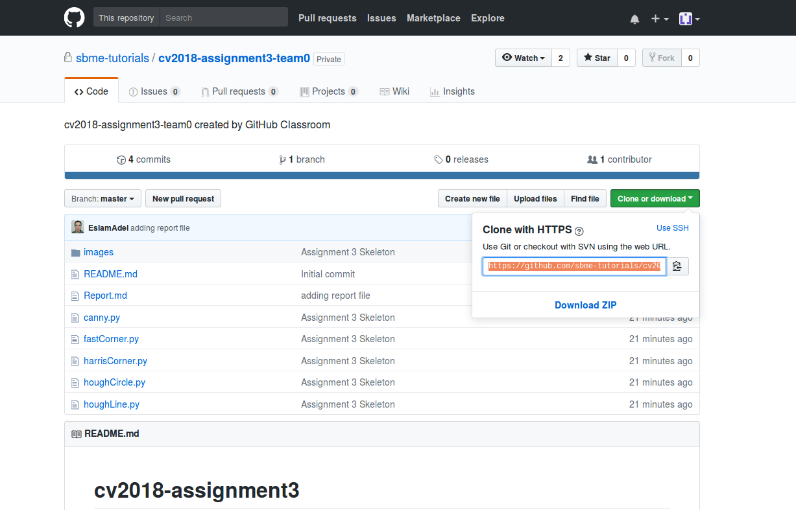

* TOC
{:toc}

## Objectives
* Advanced edge detectors.
* Line detection in image.
* Circle detection in image. 
* Image feature detection (Corners).
* Markdown

## Prerequisites (Before you start)

Read following section notes: 
* [Week 4 Notes](){:target="_blank"}
* [Week 5 Notes](){:target="_blank"}
* [Week 6 Notes](){:target="_blank"}

## Deadline
Deadline for online submission will be **12 /4/ 2018 12:00AM** . Discussion of assignment 1 and 3 will be on **14/4/2018**
## Joining Assignment Repository
1. Go to assignment [link](https://classroom.github.com/g/qNg1IiTd). 
2. Join existing team or create a new team. 
3. Wait till your repository created.
4. Clone repository 

**Note :** 

All students must join their    teams.

## Part 1: Programming

**Tasks to implement**

1. Implement Canny edge detector.
2. Implement Hough transform to detect lines in the image. Superimpose detected lines on the original image.
3. Implement Hough transform to detect circles in the image. Superimpose detected circles on the original image.
4. Implement Harris and Stephen operator for corner. Mark detected corners on original image. 
5. Implement full FAST corner detector. Mark detected corners on the original image.

**Add your code in specified locations in source files**

## Part 2: Written
Report all details about your implementations in markdown file (Report.md). Report must show sample results of your code. Organize the report and be concise. State issues you faced in the assignment and how you treated with it. Mention any kind of contribution of students from other teams.
### How to ask for help?
You can ask me to review your code, give an advice and fixing bugs. It is so easy, you have just to commit your buggy code and push it to github then mention me in the a comment and I will review the code.

### Contribution of each individual student
Each individual student must have a github account and his contribution in assignment problems must be clear via his commits and interaction with his teams' commits. Extra bonus for those who are more active and have large contribution in assignment solution.

### Team collaboration using git
Git is an effective tool for collaboration management. All team members can work independently on the same code at the same time even on the same line of code. Git will manage this and will merge all of these work in one source code. Git notifies team members if a conflict occurred. There is more collaboration methods like forking a repository, pull requests, branching, opening issues and more.   

### You are late.

Remember you will be graded based on your commits. Don't wait for submission deadline to push all the source code. You can ask me for reviewing your code and identifying bugs. If you need to improve some code that already works you can make a new branch and work on it, if it's ok you can merge it back to master branch or if not you can delete it.

If you have any problem about how to use git don't hesitate to ask me. We can discuss it in office hours or schedule an extra session for it.  

## Important Notes 
* You are allowed to discuss task problems with your mates. But code must be on your own.
* You can get few code lines from internet and include them in your own code, provided that these lines aren't the solution of task problems and you must cite the source.
* Sharing few code lines of your own with your classmates is allowed for identifying and fixing bugs, it is not allowed to see others solution before submitting.
* Copy and paste are not allowed. It leads to zero.
* Similar submissions will not be considered, both teams will receive zero.
* Report must include summary about your implementation, sample results and issues that you faced and how you fixed it.
* You must mention any kind of contribution of other mates.