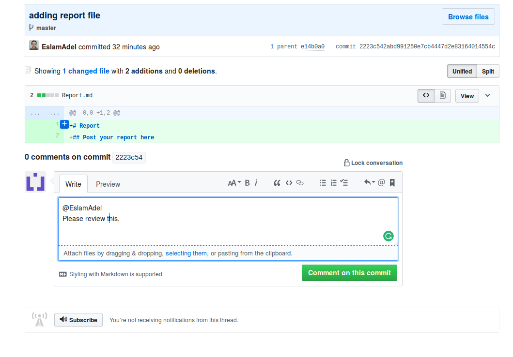

* TOC
{:toc}

## Objectives
* Thresholding segmentation
* Region based segmentation
* Clustering segmentation

## Prerequisites (Before you start)

Read following section notes: 
* [Week 7 Notes](){:target="_blank"}
* [Week 8 Notes](){:target="_blank"}

## Deadline
Deadline will be **24 /4/ 2018**.

## Joining Assignment Repository
1. Go to assignment [link](https://classroom.github.com/g/Ps_PMpKT). 
2. Join your team. 
3. Clone repository. 

## Part 1: Programming

**Tasks to implement**

1. Implement Otsu thresholding algorithm (use minimization of within class variance approach). Binarize the image according to this optimal threshold.

2. Implement region growing segmentation. Allow user to set an initial seed and then segment this region according to similarity of colors or intensity.

3. Implement mean shift segmentation using flat kernel. Segment image based on 1D, 2D, and 3D feature spaces.

## Part 2: Written

Report a brief description of your implementations in markdown file (Report.md).

* Report must show sample results of your code. 

* State issues you faced in the assignment and how you treated with it. 

* Mention any kind of contribution of students from other teams.

## How to ask for help?
You can ask me to review your code, give an advice and fixing bugs. It is so easy, you have just to commit your buggy code and push it to github then mention me in the a comment and I will review the code.

## Contribution of each individual student
Each individual student must have a github account and his contribution in assignment problems must be clear via his commits and interaction with his teams' commits. Extra bonus for those who are more active and have large contribution in assignment solution.

## Important Notes 

* You are allowed to discuss task problems with your mates. But code must be on your own.

* You can get few code lines from internet and include them in your own code, provided that these lines aren't the solution of task problems and you must cite the source.

* Sharing few code lines of your own with your classmates is allowed for identifying and fixing bugs, it is not allowed to see others solution before submitting.

* Copy and paste are not allowed. It leads to zero.

* Similar submissions will not be considered, both teams will receive zero.
