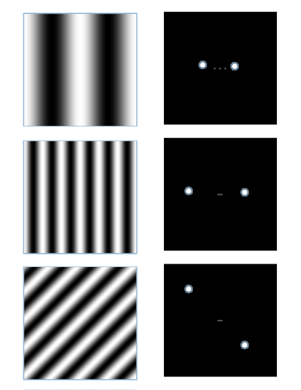
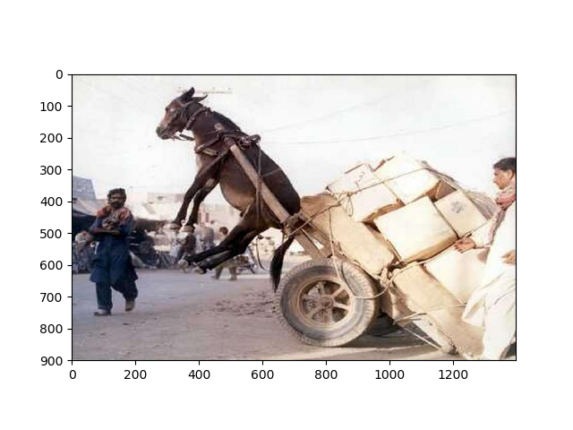
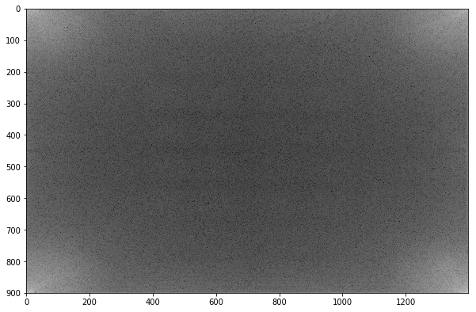
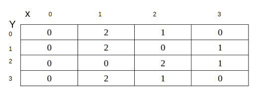
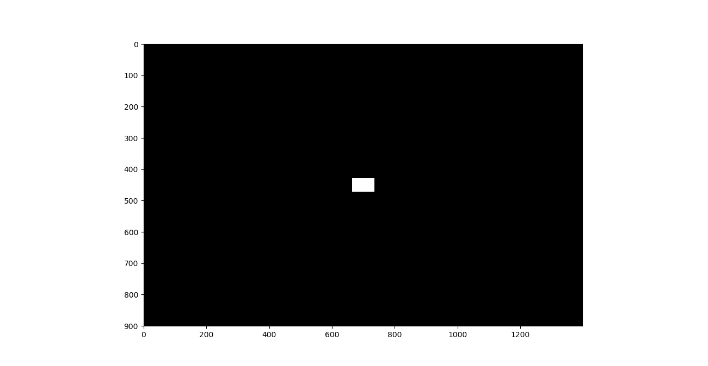
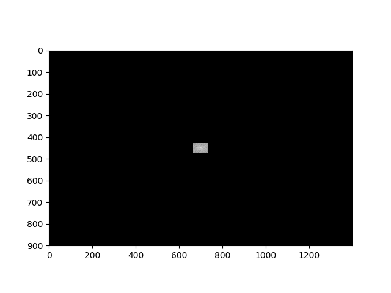
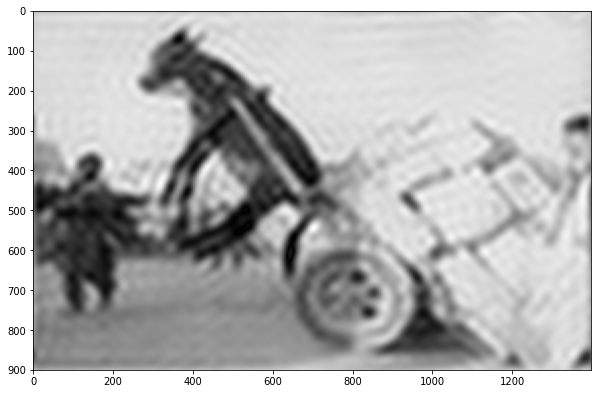
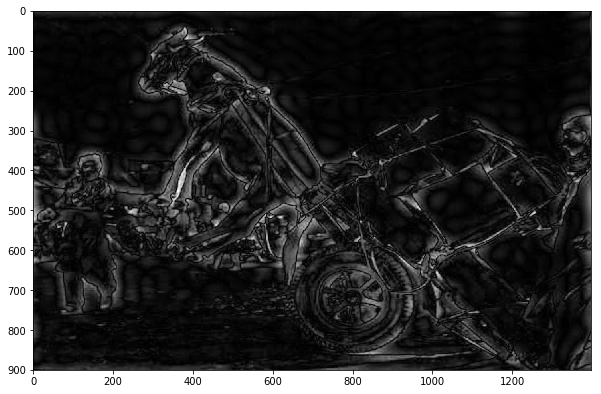

* TOC
{:toc}

## Discrete Fourier Transform (DFT)
Fourier transform is a decomposition of a signal into some basis functions. Here basis functions are weighed sum of sin and cos functions 
Given a discrete image I(x,y) the fourier transform of it is  :

$$ I(u,v) = \sum_{x= 0}^{N_{clos} - 1 } \sum_{y = 0}^{N_{rows} - 1}  I(x,y) e^{-i2 \pi (\frac{xu}{N_{cols}}+\frac{yv}{N_{rows}})}$$

Low frequency components are found at the central regions while high frequency components are in peripherals.

The Original Image

Fourier Transform of the image Without shifting

Fourier Transform of the image after shifting. Shifting is done to move zero frequency component to the center of the image.

### Example 

For the image shown find Fourier transform at points I(0,0), I(0,1) and I(1,0)

### Solution 
* **F(0,0)**
        
    1. $$ I(0,0) = \sum_{x= 0}^{3} \sum_{y = 0}^{3}  I(x,y) e^{-i2 \pi (\frac{x*0}{4}+\frac{y*0}{4})}$$    
    2. $$ I(0,0) = \sum_{x= 0}^{3} \sum_{y = 0}^{3}  I(x,y) e^{0}$$
    3. $$ I(0,0) = \sum_{x= 0}^{3} \sum_{y = 0}^{3}  I(x,y)  = 12 $$

* **F(0 , 1)**
    
    1. $$ I(0,1) = \sum_{x= 0}^{3} \sum_{y = 0}^{3}  I(x,y) e^{-i2 \pi (\frac{y}{4})}$$
    2. $$ I(0,1) = 2 e^{-2 \pi j(0)} +  e^{-2 \pi j(0)} + 2 e^{-2 \pi j(\frac{1}{4})} + $$ 
    
    $$        e^{-2 \pi j(\frac{1}{4})} + 2 e^{-2 \pi j(\frac{2}{4})} + e^{-2 \pi j(\frac{2}{4})} + 2 e^{-2 \pi j(\frac{3}{4})}  +  e^{-2 \pi j(\frac{3}{4})} = 0 $$ 
 * **F(1, 0)**
    1. $$ I(1,0) = \sum_{x= 0}^{3} \sum_{y = 0}^{3}  I(x,y) e^{-i2 \pi (\frac{x}{4})}$$
    2. $$ I(1,0) = 6 e^{-2 \pi j(\frac{1}{4})}+ 4 e^{-2 \pi j(\frac{2}{4})}  + 2 e^{-2 \pi j(\frac{3}{4})}$$ 
    3. $$I(1,0) = -4 - 4j$$ 

## Properties of DFT 

 * ### Complex
  It is a complex representation of the image. So it includes a magnitude and a phase.  Magnitude component is the desired one in visualization. It represents the weight of each frequency component and gives an intuitive impression about frequency spectrum of the image. Due to large variations in magnitudes (Center of the image has a high value compared with other values) we display it in a log scale to compress dynamic range  see [link](https://homepages.inf.ed.ac.uk/rbf/HIPR2/pixlog.htm)

  $$ log_{10} (1 + ||I(u, v )||)$$

  1. Magnitude image without log transformation
  
  2. Magnitude image with log transformation
  

  Phase is very important for image recovery but has no significance in visualization 
 * ### High and low frequency components
  In Fourier domain central regions represent the low frequency components and peripheral regions represent the high frequency components and the center of the image represents the DC value with zero frequency which is the total intensity of the image.

 * ### No one to one corresponding
   where each point in frequency domain is calculated from the whole spatial image

   $$I(u,v) = T(I)(x,y)$$ not $$T(I(x,y))$$ 
   
 * ### Symmetric
  which means that we can recover the image if we have only the half of fourier domain. This is a very important property in fourier transform and used in MRI imaging see [partial fourier imaging](http://mriquestions.com/partial-fourier.html). 

 
 
 **Question**: Where redundancy comes from ?? 
 
 **Answer** : Each point in fourier domain is a complex with two information magnitude and phase or real part and imaginary part. So half of fourier image actually hold up the whole information of the spatial domain image.
 
 * ### Periodic 
 As we deal with a digital images (Sampled) and sampling implies periodicity so 2D FT is periodic.

 
## Inverse Fourier Transform

 $$ I(x,y) = \frac{1}{N_{rows} N_{cols}} \sum_{u= 0}^{N_{clos} - 1 } \sum_{v = 0}^{N_{rows} - 1}  I(u,v) e^{i2 \pi (\frac{xu}{N_{cols}}+\frac{yv}{N_{rows}})}$$

 Inverse transformation from  spatial domain to spatial domain. Looks like fourier transform except for the sign of exponential and the weight of the function.
## Fourier Filtering    

Basic concept of fourier filtering is to mask desired frequencies and suppress undesired components. It is just multiplication process alternative to convolution in spatial domain which is computationally expensive. the block diagram of fourier filtering process 

### Ideal LPF Example
This is the filter that masks the low frequency components 

Spectrum of the image after applying the ideal LPF 

the effect of suppression high frequency components is blurring the image

### Ideal HPF Example 
This is the filter that masks the high frequency components 

Spectrum of the image after applying the HPF 

Suppression of low frequency components will produce an edge image

## Color Image Processing Block Diagram 

Dealing with colored images is not applicable in RGB color space. So we need to move to another color space for example HSV color space and applying our filtering on the channel associated with intensity (Here value channel). Now region channels again and finally return back to RGB color space. The block diagram is illustrated in the following figure.

This is the result of applying this block diagram on the previous filtered images. We can see that color information returned back to the image.

## Demo 
You can download the demo from [cv_week3_demo](https://github.com/sbme-tutorials/cv_week3_demo.git).
