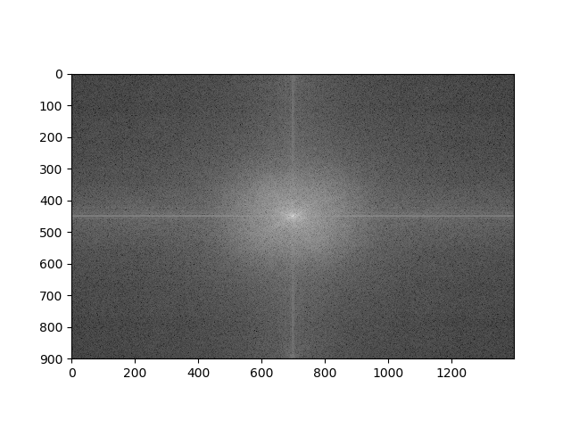
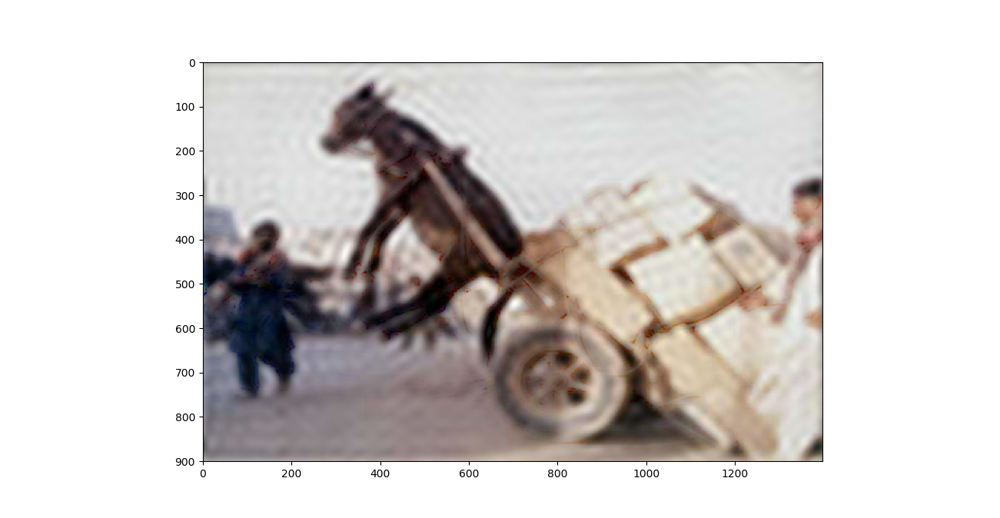
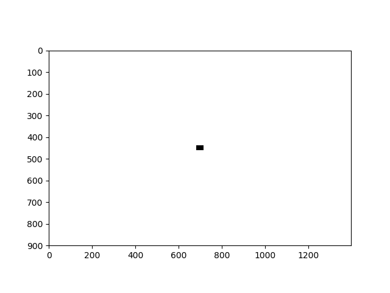
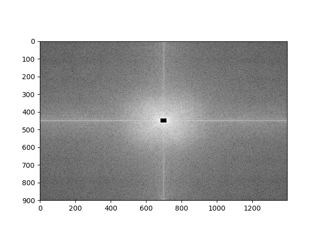
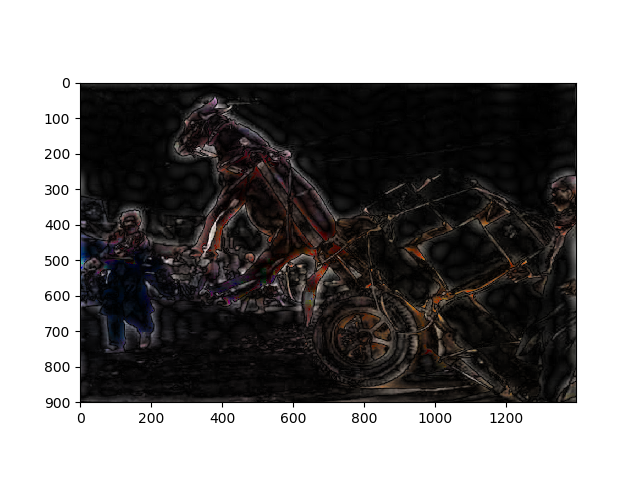

* TOC
{:toc}

## Discrete Fourier Transform (DFT)
Fourier transform is a decompisition of a signal into some basis functions. Here basis functions are wiegted sum of sin and cos functions 
Geiven a discrete image I(x,y) the fourier transform of it is  :

$$ I(u,v) = \sum_{x= 0}^{N_{clos} - 1 } \sum_{y = 0}^{N_{rows} - 1}  I(x,y) e^{-i2 \pi (\frac{xu}{N_{cols}}+\frac{yv}{N_{rows}})}$$

## Properties of DFT 

 * FT is a complex representation of the image. So it includes a magnitude and a phase 
  Magnitude component is the desired one in visualization. It represents the weight of each frequency component and give an intuitive impression about frequcy spectrum of the image. Due to large variations in magnitudes (Center of the image has a high value compared with other values) we display it in a log scale to compress dynamic range  see [link](https://homepages.inf.ed.ac.uk/rbf/HIPR2/pixlog.htm)

  $$ log_{10} (1 + ||I(u, v )||)$$

  Phase is very important for image recovery but has no significance in visulaization 
 * In Fourier domain central regions represent the low frequency components and prepheral regions represent the high frequency components and the center of the image represents the DC value with zero frequency which is the average intensity of the image. Note (image profile within a scan line gives you an impression about the frequncy in that direction)
 * Direction of change in intensity has the same direcion in frequency domain
 * No one to one corresponding where each point in frequency domain is calculated from the whole spatial image
   
   $$I(u,v) = T(I)(x,y)$$ not $$T(I(x,y))$$ 
   
 * Fourier transfor of the image is symmetric which mean that we can recover the image if we have only the half of fourier domain. This is a very important property in fourier transfrom and used in MRI imaging see [partial fourier imaging] (http://mriquestions.com/partial-fourier.html). 
 
 Question: Where redundancy comes from ?? 
 
 Answer : Each point in fourier domain is a complex with two informations magnitude and phase or real part and imaginary part. So half of fourier image actually hold up the whole information of the spatial domain image.
 
 * DFT is periodic (remember discretization implies periodicity) and aliasing in frequecny domain leads to overlapping in image domain. 
 
## Inverse Fourier Transform

 $$ I(x,y) = \frac{1}{N_{rows} N_{cols}} \sum_{u= 0}^{N_{clos} - 1 } \sum_{v = 0}^{N_{rows} - 1}  I(u,v) e^{i2 \pi (\frac{xu}{N_{cols}}+\frac{yv}{N_{rows}})}$$

 Inverse transformation from  spatial domain to spatial domain. Looks like fourier transform except for the sign of exponential and the weigting of the function.
## Fourier Filtering    

```python
# import the necessary packages
from os import listdir
from os.path import isfile , join
import numpy as np
import matplotlib.pyplot as plt
import matplotlib.colors as col
import matplotlib.image as mpimg
from scipy import fftpack

def rgb2gray(rgb_image):
    try:
        # Check if it has three channels or not 
        np.size(rgb_image, 2)
    except:
        #If not so it is already gray image
        return rgb_image
    #Else it is a colored image
    return np.dot(rgb_image[...,:3], [0.299, 0.587, 0.114])

def extractValueChannel(image):
    try:
        # Check if it has three channels or not 
        np.size(image, 2)
    except:
        return image
    hsvImage = col.rgb_to_hsv(image)
    return hsvImage[..., 2]
    

def multi_view( images ):
    images_count = len( images )
    fig = plt.figure(figsize=(10,20))
    for row in range( images_count  ):
        ax1 = fig.add_subplot( images_count , 1 , row + 1)    
        ax1.imshow( images[ row ] )

def generateLPF(image,w,h, filtType):
    m = np.size(image,0)
    n = np.size(image,1)
    LPF = np.zeros((m,n))
    HPF = np.ones((m,n))
    xi = np.round((0.5 - w/2) * m)
    xf = np.round((0.5 + w/2) * m)
    yi = np.round((0.5 - h/2) * n)
    yf = np.round((0.5 + h/2) * n)
    LPF[int(xi):int(xf),int(yi):int(yf)] = 1
    HPF[int(xi):int(xf),int(yi):int(yf)] = 0
    if filtType == "LPF":
        return LPF
    elif filtType == "HPF":
        return HPF
    else:
        print("Only Ideal LPF and HPF are supported")
        exit(0)


if __name__ == "__main__":
    # Get file names in current directory
    images_files = [ join("./images" , f) for f in listdir("images") if isfile(join("images" , f)) ]
    images = [ mpimg.imread( f ) for f in images_files ]
    vImages = [ extractValueChannel( img ) for img in images ]
    selectedImage = images[2]
    plt.figure("Original Image")
    plt.imshow(selectedImage)
    myImage = vImages[2]
    # Take the fourier transform of the image.
    F1 = fftpack.fft2(myImage)
    F2 = fftpack.fftshift( F1 )
    F3 = np.abs(F2)
    F4 = np.log10(1 + F3)
    plt.figure("Fourier Spectrum of the image")
    plt.imshow(F4)
    plt.set_cmap('gray')
    
    #Generate Ideal Low pass filter 
    LPF = generateLPF(myImage,0.05, 0.05, "LPF")
    plt.figure("Ideal Low Pass Filter in frequency domain")
    plt.imshow(LPF)
    
    plt.figure("Spectrum After applying LPF")
    plt.imshow(LPF * F4)
    #Apply the filter
    filteredImg = np.abs(fftpack.ifft2(LPF * F2))
    filteredImg = filteredImg/np.max(filteredImg)
    
    hsvImage = col.rgb_to_hsv(selectedImage)
    hsvImage[...,2] = filteredImg
    finalImage = col.hsv_to_rgb(hsvImage)
    plt.figure("Filtered Image")
    plt.imshow(finalImage)
    plt.show()
```










## Color Image Processing Block Diagram 

Dealing with colored images is not applicable in RGB color space. So we need to move to another color space for example HSV color space and applying our filtering on the channel associated with intensity (Here value channel). Now region channels again and finally return back to RGB color space. The block diagram is illustrated in the following figure.


