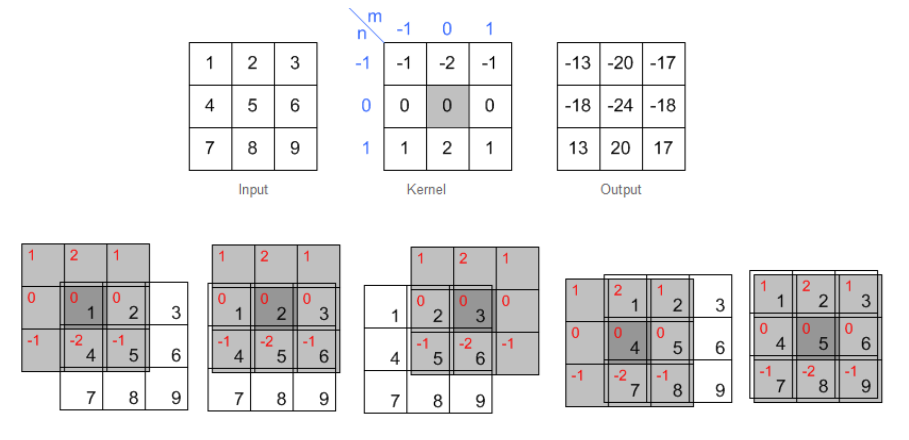
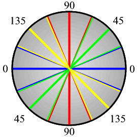
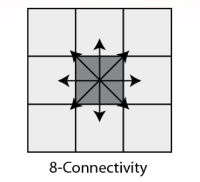

* TOC
{:toc}

## 2D Convolution 

Convolution is the process to apply a filtering kernel on the image in spatial domain.  

Basic Steps are 
1. Flip the Kernel in both horizontal and vertical directions (center of the kernel must be provided)
2. Move over the array with kernel centered at interested point.
3. Multiply kernel data with overlapped area.
4. Sum or accumulate the output.

**Note :** 

Size of output must be same size of input and we need to pad image for not defined pixels. 

### Example 

[source](http://www.songho.ca/dsp/convolution/convolution2d_example.html)




## Smoothing Kernels 
Smoothing filters are used in preprocessing step mainly for noise removal. There ar different kernels for smoothing 
 
### Box, mean or average filter 
 Example 3x3 box filter 

 $$ \frac{1}{9}
 \begin{bmatrix}
 1 & 1 & 1 \\
 1 & 1 & 1 \\
 1 & 1 & 1 \\
 \end{bmatrix} $$

### Gaussian filter 

Derived from 2D gaussian function 

$$
\begin{equation}
h(u,v) = \frac{1}{2 \pi \sigma^2} e^{(- \frac{u^2 + v^2}{\sigma^2})}
\end{equation}
$$

Example: This kernel is approximation of gaussian  function 

 $$ \frac{1}{16}
\begin{bmatrix}
1 & 2 & 1 \\
2 & 4 & 2 \\
1 & 2 & 1 \\
\end{bmatrix} $$

### Median Filter 
It is nonlinear digital filter. It is efficient in removal of what so called salt and pepper noise.

## Edge detection kernels

Edges represents the object boundaries. So edge detection is a very important preprocessing step for any object detection or recognition process. Simple edge detection kernels are based on approximation of gradient images. Another advanced edge detection algorithms will discussed in details.

### Prewitt operator 

For $$I_x(x,y)$$

 $$
\begin{bmatrix}
    -1 & 0 & 1 \\
  -1 & 0 & 1 \\
   -1 & 0 & 1 \\
\end{bmatrix} $$

For $$I_y(x,y)$$

 $$
\begin{bmatrix}
    -1 & -1 & -1 \\
  0 & 0 & 0 \\
   1 & 1 & 1 \\
\end{bmatrix} $$

### Sobel operator

For $$I_x(x,y)$$

 $$
\begin{bmatrix}
-1 & 0 & 1 \\
-2 & 0 & 2 \\
-1 & 0 & 1 \\
\end{bmatrix} $$

For $$I_y(x,y)$$ 

$$
\begin{bmatrix}
-1 & -2 & -1 \\
0 & 0 & 0 \\
1 & 2 & 1 \\
\end{bmatrix} $$

### Laplacian 
It is an approximation of second order derivative that defines zeros crossing. 
For Example 3x3 laplacian is : 

$$
\begin{bmatrix}
0 & 1 & 0 \\
1 & -4 & 1 \\
0 & 1 & 0 \\
\end{bmatrix} $$

Laplacian usually is applied after gaussian smoothing. So LOG refers to laplacian of gaussian.

## Gradient magnitude and direction

Gradient magnitude of the image relates both directions $$I_x(x,y)$$ and $$I_y(x,y)$$. It represents the strength of the edge. While gradient angle represents the direction of the edge or direction of intensity variation.

Gradient magnitude is given by 

$$
\begin{equation}
I_{xy} = \sqrt{I_x(x,y)^2 + I_y(x,y)^2}
\end{equation}
$$

and Gradient direction: 

$$
\begin{equation}
I_{\theta} = tan^{-1}(\frac{I_y(x,y)}{I_x(x,y)})
\end{equation}
$$

## Canny edge detection algorithm

It was developed by [John F. Canny](https://en.wikipedia.org/wiki/John_Canny) in 1986. Canny operator is a multi-stage algorithm that detects wide range of edges. 

**Stages**
1. Smoothing for noise removal.
2. Finding Gradients.
3. None-maximum suppression.
4. Double Thresholding.
5. Edge Tracking by hysteresis.

### Smoothing 
The first stage in canny edge detection algorithm is smoothing to remove noise that may cause false edges. Kernel used in this step is 5x5 gaussian kernel with $\sigma = 1.4$ and that it

$$ \frac{1}{159}
\begin{bmatrix}
2 & 4  & 5  & 4  & 2 \\
4 & 9  & 12 & 9  & 4 \\
5 & 12 & 15 & 12 & 5 \\
4 & 9  & 12 & 9  & 4 \\
2 & 4  & 5  & 4  & 2 \\
\end{bmatrix} $$

### Finding Gradients

This is done using sobel operator in both x and y direction and getting gradient magnitude as described later.

### None-maximum suppression

We aim to suppress all weak edges except local maxima. To do that we have to use gradient direction image. 

1. Compare the edge strength of the current pixel with the edge strength of the pixel in the positive and negative gradient directions.
2. Suppress that pixel (set to zero) if its value is lower than pixels in same direction.

Direction must be quantized to 8 directions or angles to use 8-Connectivity. 

 


The result of this stage would be an edge image with thin edges.

### Double thresholding

After none-maxima suppression we need to suppress pixels with low gradient values to have only strong edges. None-maxima suppression eliminates only local weak edges but here we globally eliminate weak edges. We have two threshlods $T_l$ and $T_h$ selected by user. 

```python
if image[x,y] < TL:
    image[x,y] = 0
elif image(x,y) > TH:
    image[x,y] = 1
```

What about pixels with in-between values ? 

Next section tells us.

### Edge tracking by hysteresis

For pixels with values in-between $T_l$ and $T_h$ we check the 8 neighbors if it has a strong point in its neighbors so it is a part of the edge and if not suppress it.


