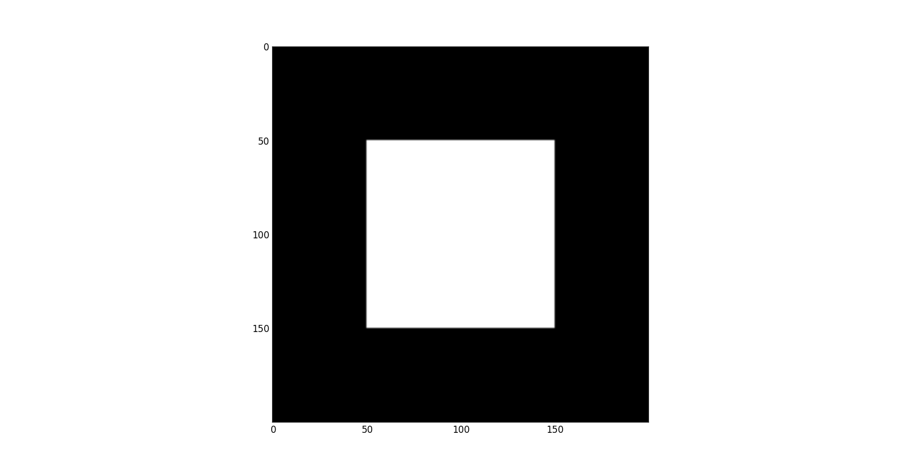
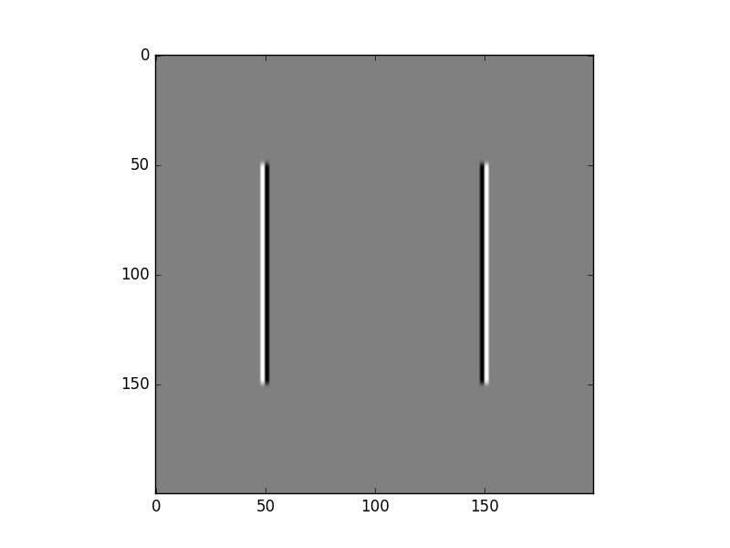
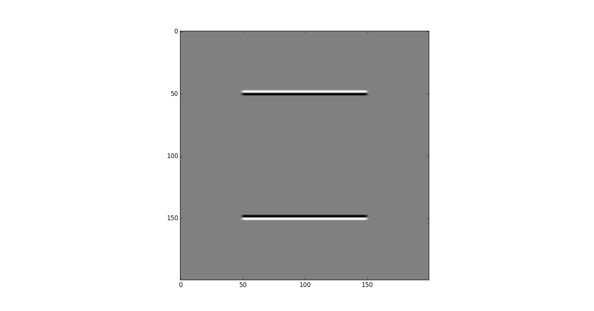
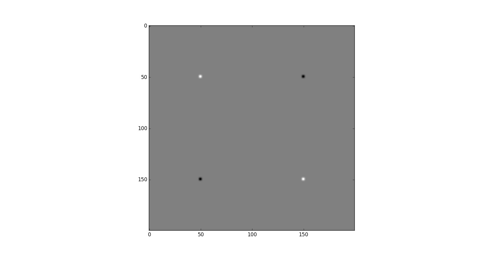
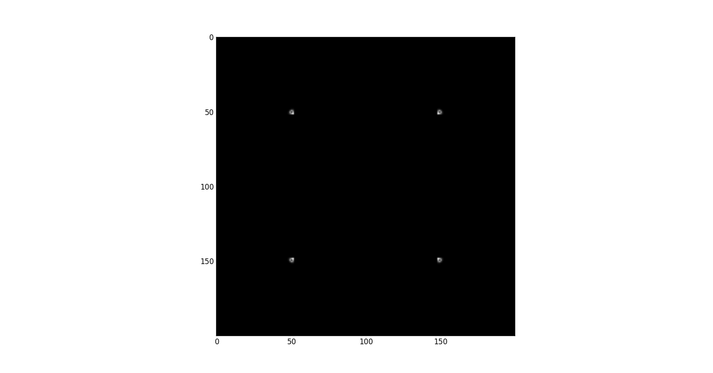

* TOC
{:toc}

## Readings 
[Fundamentals of Features and Corners](http://aishack.in/tutorials/features/)


## Motivation 
Image matching is an important task in computer vision. We need to know if two different images are for same scene or not. It is a challenging task. Challenges arise from different geometric and photometric transformation. Geometric transformations include translation, rotation and scaling. Photometric transformations like change in brightness or exposure. For example, next two figures are images for same scene. How can we match them ?


### Good feature properties
Good features must be 
* Unique and distinctive 
* Robust and efficient
* Global and not specific

## Patch Matching 
The basic idea for image matching is patch matching. Patch matching is applied by selection of patch (square) in one image and match it with a patch in the other image. 

### Which patch to select ?

As we seen in the next figure, the patch in left image will be matched with many patches in the right image. So it will be confusing to select such patch. We need a patch with unique shape in the image. 


Now what about patches selected in left image. It will be matched with an alternative unique one in the right image. We can conclude that corners are unique points in images. We can use corners as image feature.


Let's compare different image region 


Flat region has no variation in both directions. Edges are better as it has a variation in one direction, but it still not unique. Corners has changes in both direction and it is unique point. So conclusion is that corner is a good image feature. The next question now is given an image, How to detect its corners(features)?
## Hessian Matrix
Corner is identified by its large variation in both x and y directions. Mathematically we can build what so called hessian matrix that state the variation (derivative) in x, y and xy direction. Let $$p$$ is a pixel in the image $$I$$ hessian matrix is defined as follow:

$$
H = \begin{bmatrix}
I_{xx}(p) & I_{xy}(p) \\ I_{xy}(p) & I_{yy}(p) & 
\end{bmatrix}
$$

Where $$I_{xx}(p)$$ is the second derivative of image in x direction at point p. $$I_{yy}(p)$$ is the second derivative of image in y direction at point p. $$I_{xy}(p)$$ is the partial derivative in x and y at point p. 
### Eigen Values and Eigen Vectors
Eigen vectors identify direction of data variation and corresponding Eigen values identify magnitude of variation that direction. For example 

In the following figure we have two eigen vectors $$u$$ and $$v$$. Each vector has a length corresponding to its eigen value. So there is a large variation in $$u$$ direction and lower variation in $$v$$ direction.


We can calculate eigen values using following equation 

$$
|\lambda I - H| = 0
$$

## Corner Detector using eigen values
Getting the two eigen values of hessian matrix for all points will tell us category of that point. If both values are small so we in a flat region and no variation in any direction. If one of eigen values larger than the other So we have an edge point. And if both eigen values are large so we have a corner. Next figure illustrates that. 


But calculating eigen values of hessian matrix for all image pixels is computationally complicated. So another operators was proposed. 
## Harris Operator
Harris operator or harris corner detector is more simple. It identifies corner from hessian matrix as follow: 

$$
Harris = det(H) - a \times trace(H)
$$

Where $$a$$ is a constant and $$trace(H)$$ is the sum of diagonal elements of hessian matrix. Corners will have a high value of its harris operator.

**Lets Try to implement it**

### Basic Implementation

* Load some libraries

```python
import numpy as np
import matplotlib.pyplot as plt
from scipy import signal
```

* Let's define our custom harris method

```python
def myHarris(image):
    '''
    Compute Harris operator using hessian matrix of the image 
    input : image 
    output : Harris operator.
```
* Now we have to build hessian matrix 
As we know sobel operator is an approximation of first order derivative
**Note :** if we want the second derivative basically we need to differentiate twice.
```python
 # x derivative
    sobelx = np.array([[-1, 0, 1],
                       [-2, 0, 2],
                       [-1, 0, 1]])

    #y derivative
    sobely = np.array([[-1, -2, -1],
                       [ 0,  0,  0],
                       [ 1,  2,  1]])
    # Get Ixx 
    # To get second derivative differentiate twice.
    Ixx = signal.convolve2d(signal.convolve2d(image, sobelx, "same"),sobelx,"same")     
    # Iyy  
    Iyy = signal.convolve2d(signal.convolve2d(image, sobely, "same"),sobely,"same")
    # Ixy Image 
    Ixy = signal.convolve2d(signal.convolve2d(image, sobelx, "same"),sobely,"same")
```
* Finally calculate Harris operator
```python
    # Get Determinant and trace 
    det = Ixx*Iyy - Ixy**2
    trace = Ixx + Iyy

    # Harris is det(H) - a * trace(H) let a = 0.2 
    H = det - 0.2 * trace
```
* Lets show them and return harris operator

```python
    # Lets show them 
    plt.figure("Original Image")
    plt.imshow(image)
    plt.figure("Ixx")
    plt.imshow(Ixx)
    plt.set_cmap("gray")
    plt.figure("Iyy")
    plt.imshow(Iyy)
    plt.figure("Ixy")
    plt.imshow(Ixy)
    plt.figure("Harris Operator")
    plt.imshow(np.abs(H))
    plt.show()

    return H
```
* Finally we need to test our method 

we will build a basic test image in our own. It is a black image with a white square in it.
```python
image = np.zeros((200,200))
image[50:150,50:150] = 255

# Get harris 
harris = myHarris(image)
```
### Results 
* Original Image

* 2nd Derivative in x $$I_{xx}$$

derivative in x direction will produce a vertical edges
* 2nd Derivative in y $$I_{yy}$$

derivative in y direction will produce a horizontal edges
* Partial derivative of x and y $$I_{xy}$$

derivative of both direction will distinct corner points.
* Harris operator


**What's next?**
We can then get maximum points in harris image according to threshold value, identify its coordinates and overlie it on the original image.

Result of harris on real images will be like that


## Harris and Stephens operator
It is not a new method for corner detection. It computes the harris operator also not from hessian matrix but from G matrix where G matrix is

$$
G(\rho, \sigma)  = \begin{bmatrix}
L_x^2(\rho, \sigma) &   L_x(\rho, \sigma)L_y(\rho, \sigma) \\  L_x(\rho, \sigma) L_y(\rho, \sigma) & L_y^2(\rho, \sigma) 
\end{bmatrix}    
$$

instead of calculating second derivative. Use square of first derivative image that has smoothed with gaussian filter.

### Results 
This is the result of custom implementation


## Features from Accelerated Segment Test (FAST) 
It is used for real time applications with limited computing resource. It identifies the corner from surrounding 16 pixels on a circle of radius 3 from interested point.


### Basic Algorithm
Psedo code for basic algorithm is 
```python
1. Select Pixel p with intensity Ip 
2. Select Threshold t
3. Consider circle with 16 pixels.
4. Calculate absolute difference between Ip,Ii and i =1 to 16
5. P is a corner if n points have absolute difference > t and n >= 6
6. Suppress weak corners (None-Max suppression)
```


### High Speed Test 
Basically check using only four points.

```python
4. Calculate absolute difference between Ip,Ii Considering i =1, 9, 5, 13 only.
5. P is a corner if n points have absolute difference > t and n >= 3
6. Suppress weak corners (None-Max suppression)
```

### None-Max suppression
It is common in both basic and high speed test versions of FAST algorithm
```python
For successive corners.
1. For each corner point p
1. Compute score V which is sum of absolute difference between point p and 16 circle points.
2. Suppress if not local maximum. 
```

### Results 
This is the result of high speed test custom implementation.


## Useful links
[Harris OpenCV](https://docs.opencv.org/3.0-beta/doc/py_tutorials/py_feature2d/py_features_harris/py_features_harris.html)

[Fast Algorithm](https://docs.opencv.org/3.0-beta/doc/py_tutorials/py_feature2d/py_fast/py_fast.html)

[FAST Corner Detection Edward Rosten](https://www.edwardrosten.com/work/fast.html)