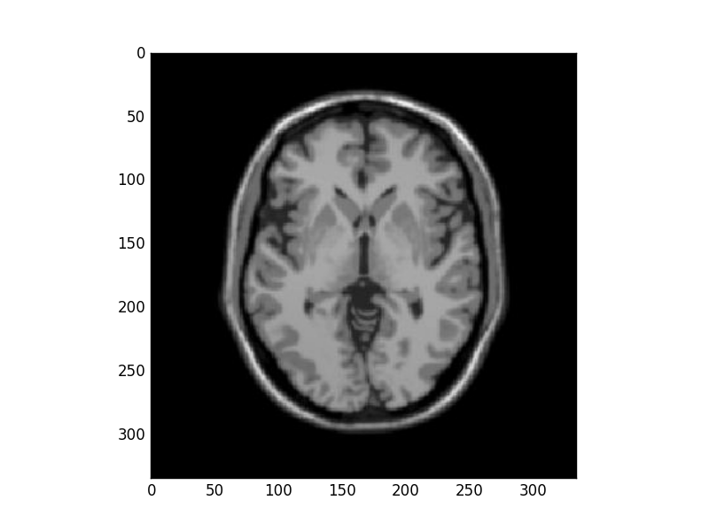
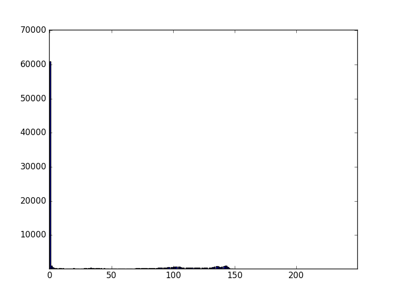
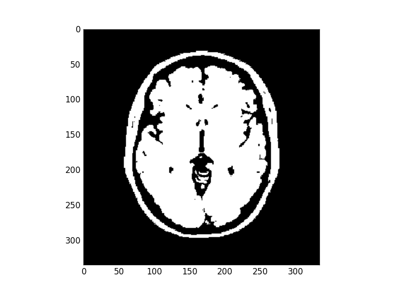

* TOC
{:toc}


## Image Segmentation

Image segmentation is the process of partitioning the image into isolated areas or segments. Each segment has similar features, for example have same intensity or same color etc, and is considered as an object in the image. There are many applications of image segmentation for medical images including automatic diagnostic applications and other application related to treatment. Treatment planning is an example of 3D image segmentation.

### 3D Segmentation 
3D object is reconstructed from series of medical images. this is an example for reconstruction of 3D human skull from a series of DICOM images scanned by CT scanner. 

<span style="display:block;text-align:center"></span>

From that skull we can segment different interested regions or objects. Here we are interested in segmentation of mandible, maxilla, upper and lower teeth. Each object now is separated and we can treat with it independently. Using these objects, dentists can plan the process of dental implant or orthodontic treatment or any similar operation. 

<span style="display:block;text-align:center"></span>

This was a project I worked on for a subject in my pre-master year under title "An optimized technique for 3D segmentation for orthodontic treatment plan". I used [VTK](https://www.vtk.org/) for reconstruction and segmentation processes and [Qt](https://www.qt.io/) for GUI design. Segmentation was based on thresholding and connectivity testing which is similar to region growing approach but in 3D.

## Histogram Based Segmentation (Image Binarization)

Histogram based segmentation or image binarization segments the image into two classes, object and background based on a certain threshold. Image will be a binary image according to following equation

$$
I(x,y) = 
\begin{cases}
0, I(x,y) < T \\\ 
1, I(x,y) > T 
\end{cases}
$$

The question here is How to select threshold ?

## Optimal Threshold

Assume we have the following histogram. For ideal case object and background would be totally isolated, optimal threshold is well defined here. 

 

Here an example of real image with isolated object, background histograms.

 

For general case histogram of object and background are merged together, we had to define performance measure of selected threshold.

## Otsu Thresholding 

### Basic Idea

Otsu thresholding aims to automatically find optimal threshold for image binarization. It assumes two classes object and background. The idea is to select the threshold that will minimize within class variance or maximize between class variance. That's means that we need to calculate these values for all gray levels and select one with minimum within class variance and also it will be the maximum between class variance. 

But what that means ? It means that optimal threshold is that one who divide histogram into two parts given that distribution of values at same segment (class) has minimum variance (Values are close to each other) or distributions of different segments (classes) are isolated (far from each other).  


[source](https://en.wikipedia.org/wiki/Otsu%27s_method)

Maximizing between class variance

### Within class variance

Within class variance $$\sigma_w^2$$ can be calculated at specific threshold value $$t$$ as follow

$$
\sigma_w^2  = c_1 \sigma_1^2 + (1-c_1) \sigma_2^2 
$$

Where $$c_1$$ is the cumulative sum at that threshold $$t$$, $$\sigma_1^2$$ is the variance of first class and $$\sigma_2^2$$ is the variance of second class. We can conclude that $$\sigma_w^2$$ is a weighted sum of variances of both classes.

### Between class variance

For between class variance $$\sigma_b^2$$ it is calculated for specific value of threshold $$t$$ as follow 

$$
\sigma_b^2  = c_1 (1-c_1) (\mu_1 - \mu_2)^2  
$$

where $$\mu_1$$ and $$\mu_2$$ is the mean of class 1 and 2 respectively.
### Mean and variance calculation 

Recall that mean or expected of variable $$x$$ with probability density function $$p(x)$$ is defined as 

$$
E[x] = \sum x p(x)
$$

and variance 

$$
\sigma^2 = E[x^2] - \mu^2
$$

#### How to get pdf of both classes ? 

Given the relative histogram that represent the pdf of all the image. We can determine the pdf of class 1 with gray levels < threshold t by dividing the relative histogram by the total probabilities till that threshold t which is cumulative probability at that threshold CDF(t). For second class we can get its pdf by dividing by (1 - CDF(t)). 
### Basic Algorithm 
Basic algorithm for determining threshold that maximize between class variance is  

```python 
Get Histogram of the image
Get relative histogram (PDF)
Get cumulative Histogram (CDF)
initialize OptThreshold = 1 and maxVariance = 0
For each t in range 1 to 255 
  m1 =  mean value class 1 
  m2 =  mean value class 2  
  c1 = CDF[t]
  varBet = c1 * (1-c1) * (m1 - m2)**2   
  if value > maxVariance 
      maxVariance = value
      OptThreshold = t  
```

**Lets try to implement it**

Import some libraries

```python
import numpy as np
import matplotlib.pyplot as plt
from matplotlib import colors
```

Defining otsu function that returns the optimal threshold of input image.

```python
def otsuThresholdB(image):
    #Get size of image
    rows, cols =  image.shape
    #Plotting image histogram
    plt.figure()
    #We are interested on H (histogram), other values that plt.hist returns will be ignored here
    H, binEdges, patches = plt.hist(image.ravel(),256)
    # Getting relative histogram (pdf)
    pdf = H /(rows*cols)
    # Get cdf for all gray levels
    cdf = np.cumsum(pdf)
    #Initialization
    othresh = 1
    maxVarB = 0
```
Calculation of between class variance of all gray levels and extract threshold with max variance

```python
    for t in range(1,255):
        #gray levels belongs to background 
        bg = np.arange(0,t)
        #object gray levels
        obj = np.arange(t, 256)
        #Calculation of mean gray level for object and background
        mBg    = sum(bg*pdf[0:t])/cdf[t]
        mObj   = sum(obj*pdf[t:256])/(1-cdf[t])
        # Calculate between class variance
        varB = cdf[t] * (1-cdf[t]) *(mObj - mBg)**2
        #Pick up max variance and corresponding threshold
        if varB > maxVarB:
            maxVarB= varB
            othresh = t
    return othresh
```
We didn't finished yet. we will use that threshold to binarize the image so lets define this function

```python
def binarize( gray_image , threshold ):
    return 1 * ( gray_image > threshold )
```
Here is the main function

```python
#Read an image
image = plt.imread('images/MRIbrain3.jpg')
#Extract value channel (intensity)
hsvImage = colors.rgb_to_hsv(image)
myIm = hsvImage[...,2]
#Show original image
plt.figure()
plt.imshow(myIm)
plt.set_cmap("gray")
#Get optimal threshold
oTb = otsuThresholdB(myIm)
#Binarize the image and show it
binaryIm = binarize(myIm, oTw)
plt.figure()
plt.imshow(binaryIm)
plt.show()
```
**Results**

Original Image 



Histogram of the image



The binary image optimal threshold value was 66 



 What about minimizing within class variance ?

## Seed Pixels (Region Growing)
Segmentation starts with initial seed point. Neighbors of that pixel will be merged if they similar to it. Similarity criteria may be defined as intensity or color. Process continues till no more similar neighbors found. For example next figure shows segmented regions for different seed points.

 

