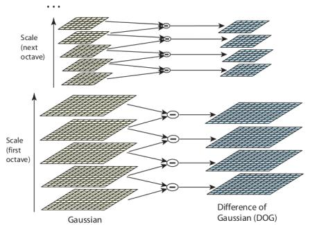
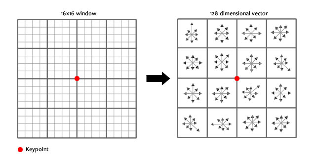
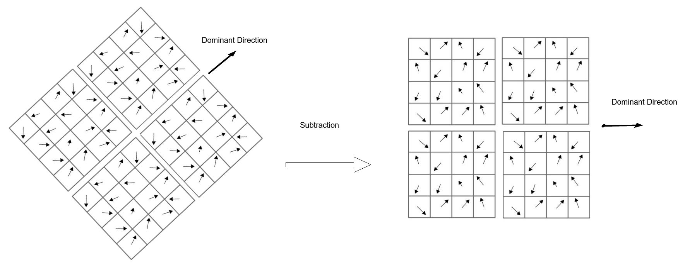
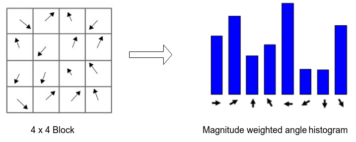
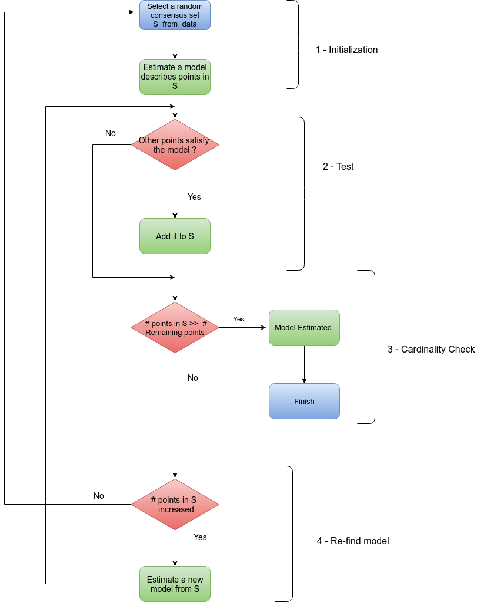
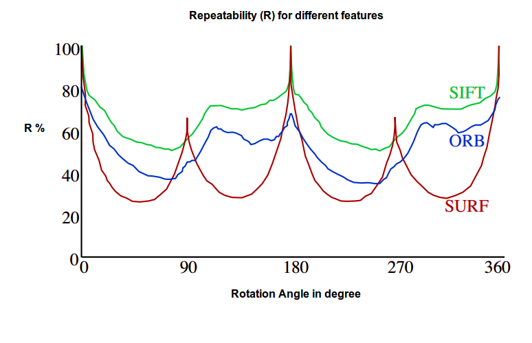

> These notes are inspired by slides made by TA Eng.Mohamed Hisham

* TOC
{:toc}

## Features and feature descriptors 

Features or **key-points** of the image are corners that are unique in the image. Harris and FAST are two different corner detectors we have discussed later. Corner detectors are invariant for translation illumination and rotation. But it is not invariant for scaling. 

**Lets see an example**

Next figure shows two different scales of same image. In smaller image it is easy to detect that there is a corner, but what about same image in the large scale. It will be difficult to detect that corner so this feature point will not be recognized for all scales. 

## Scale invariant feature descriptor (SIFT) 

Scale invariant feature descriptor (SIFT) is not a new way to find key-points or corners that is invariant to scale. But it is a descriptor of detected corners by other corner detectors in different image scales or image pyramids. 

Another point that size of the window will effect the detection of corners. Large corners needs large windows and smaller corners needs smaller windows. 

### Image pyramids and scale-spaces

Image pyramids or image scale space is a proposed method to handle image in different scales. We have two scale-spaces 

* Laplacian of gaussian (LOG) scale space 

* Difference of gaussian (DOG) scale space 

The basic idea to build scale space is shown in the following figure 

**Gaussian Pyramid**

[source](https://en.wikipedia.org/wiki/Pyramid_(image_processing))

**LOG Pyramid**

In SIFT we usually prefer DOG scale space which is an approximate of LOG and simpler in calculation. 

### SIFT scale space 

In SIFT Pyramid we have 
* Octaves 

  different levels of image resolutions (pyramids levels)

* Scales 
  
  different scales of window in each octave level (different $$\sigma$$ of gaussian window)

  

### Key-point (corner) scale localization

For each key-point (corner) we need to finds its best scale which have maximum value (cornerness measure). It is achieved by comparing same corners in the same octave with its neighbors in same, above and lower scales. Different It is not necessary for all corners to be localized at the same scale level.

### Extract SIFT feature descriptor

[source](http://aishack.in/tutorials/sift-scale-invariant-feature-transform-features/)

After localization of a key-point in our scale space. We can now get its SIFT descriptor as follow

1. Extract a $$16 \times 16$$ window centered by this point.
2. Get gradient magnitude and multiply it by a $$16 \times 16$$ gaussian window of $$\sigma =1.5$$
3. Get gradient angle direction. 
4. Adjusting orientation (To be rotation invariant):
    * Get the gradient angle of the window and Quantize them to 36 values (0, 10, 20, ..., 360)
    * Locate dominant corner direction which is most probable angle (angle with max value in 36 bit angle histogram)
    * subtract dominant direction from gradient angle.

4. Divide this $$16 \times 16$$ patch to sixteen $$4 \times 4$$ blocks
5. For each block get magnitude weighted angle histogram 
 
 angles (quantized to 8 angles [0, 45, 90, ... , 360]) based on its relevant gradient magnitude i.e (histogram of angle 0 = sum(all magnitudes with angle 0))

 

6. SIFT feature descriptor will be a vector of 128 element (16 blocks $$\times$$ 8 values from each block)

## Feature matching
The basic idea of feature matching is to calculate the sum square difference between two different feature descriptors (SSD). So feature will be matched with another that has minimum SSD value. 

$$
SSD = \sum (v_1 - v_2)^2
$$

where $$v_1$$ and $$v_2$$ are two feature descriptors.

### Brute-Force matcher
In brute-force matcher we have to match descriptor of all features in an image to descriptors of all features in another image. It is extremely expensive as we know any brute-force algorithm will guarantee finding a solution, but doesn't guarantee optimal solution.

### RANSAC 
Random sample consensus is an iterative method for estimation of parameters of a mathematical model. We will model the transformation of points in source image to destination one, and try to find the estimate of model parameters (affine transformations). The basic idea of RANSAC algorithm is shown in the following flow chart. 

RANSAC is a robust feature matcher. For example we can model the difference between two images to a set of transformations and run RANSAC to find best model that maximize correct matching.

## Evaluation criteria for different feature descriptors
To test performance of different descriptors. We use repeatability measure which is defined as:

$$R(I, I_t) = \frac{N_m}{N_k}$$

Where $$I$$ is source image $$I_t$$ is destination or transformed image. $$N_m$$ number of matched feature points. $$N_k$$ number of all feature points.

Repeatability ratio is calculated for different rotations, scales, brightness, and blurring. 

SIFT is the robust only for rotation, scaling, and variation of brightness

## Useful links

[SIFT OpenCV](https://docs.opencv.org/3.1.0/da/df5/tutorial_py_sift_intro.html)

[Feature Matching](https://docs.opencv.org/3.3.0/dc/dc3/tutorial_py_matcher.html)

[Robust matching using RANSAC](http://scikit-image.org/docs/dev/auto_examples/transform/plot_matching.html)