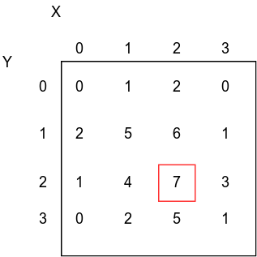
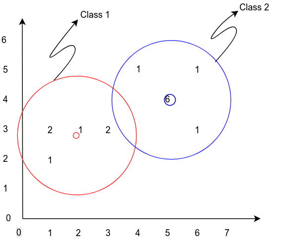

* TOC
{:toc}

## Image Segmentation
For Image segmentation we studied three methods 

* Histogram based segmentation (Image thresholding and binarization) 

  Maximize Between class variance or minimize within class variance.

* Region based segmentation (Region or seed growing) 

* Clustering based segmentation (Mean shift segmentation) 

## Otsu Binarization 

Histogram of a 3 bit image is shown in the following table

Gray level | 0 | 1 | 2 | 3 | 4 | 5 |6 | 7 |
-----------|---|---|---|---|---|---|--|---|
number of pixels| 2 | 3 | 2 | 1 | 2 |3 |2| 1|

Find optimal threshold using Otsu.

**Solution**

Plotting histogram 

Between class variance $$\sigma_b^2$$

$$
\sigma_b^2 = c_1 (1-c_1) (\mu_1 - \mu_2)^2
$$

It is clear that optimal threshold is 3. 

$$\sigma_b^2$$ at $$t = 3$$

$$c_1 = \frac{2+3+2+1}{16} = \frac{1}{2}$$

$$\mu_1 = \frac{0 \times 2+ 1 \times 3 + 2 \times 2+ 3 \times 1}{2+3+2+1} = \frac{10}{8}$$

$$\mu_2 = \frac{4 \times 2+ 5 \times 3 + 6 \times 2+ 7 \times 1}{2+3+2+1} = \frac{42}{8}$$

$$
\sigma_b^2 = 0.5 \times 0.5 (4)^2 = 4
$$

**Let's try t = 4**

$$\sigma_b^2$$ at $$t = 3$$

$$c_1 = \frac{2+3+2+1+2}{16} = \frac{10}{16}$$

$$\mu_1 = \frac{0 \times 2+ 1 \times 3 + 2 \times 2+ 3 \times 1 + 4 \times 2}{2+3+2+1+2} = \frac{18}{10}$$

$$\mu_2 = \frac{5 \times 3 + 6 \times 2+ 7 \times 1}{3+2+1} = \frac{34}{6}$$

$$
\sigma_b^2 \sim 3.5
$$

Optimal threshold is $$t = 3$$ with maximum between class variance

## Region growing

Apply region growing on the following image. Initial point at (2,2). Threshold is 2. Use 4 connectivity.

**Solution**

The segmented region is shown in the following figure condition absolute difference < 2

## Mean Shift 

Basic steps are : 

1. Select a random mean.
2. Get points around this mean within a specific bandwidth and multiply them by selected kernel. 
3. Calculate the mean of these points.
4. Repeat till convergence (new mean $$\sim$$ old mean) within a threshold.
5. Cluster all visited points to that final mean. 
6. repeat till all points in the space are clustered. 

### Example 
Points (1,2) (1,3) (1,3) (2,3) (3,3)  (3,3) (4,5) (5,4) (5,4) (5,4) (5,4) (5,4) (5,4) (6, 3) (6, 5) represent the feature space apply mean shift clustering with bandwidth of 2 and flat kernel.

**Solution**

Plotting points in feature pace

1. First trial
  * Initial mean is (2, 3) 
  * Points in bandwidth are (1,2) (1,3) (1,3) (2,3) (3,3)  (3,3)
  * New mean $$(\frac{1 \times 3 + 2 \times 1 + 3 \times 2}{6}, \frac{2 \times 1 + 3 \times 5}{6}) = (1.8, 2.8)$$
  * Second iteration: points in bandwidth of new mean are the same point and new mean will be the same (1.8, 2.8)
2. Second trial 
  * Initial mean (5, 4)
  * Points in bandwidth are  (4,5) (5,4) (5,4) (5,4) (5,4) (5,4) (5,4) (6, 3) (6, 5)
  * new mean $$(\frac{4 \times 1 + 5 \times 6 + 6 \times 2}{9}, \frac{3 \times 1 + 4 \times 6 + 5 \times 2}{9}) = (5.1, 4.1)$$
  * Second iteration:  points in bandwidth  are the same point and new mean will be the same (5.1, 4.1)

## Image analysis (Length, Area)
### Area 

For shape with N points its area is 

$$
A = \frac{1}{2} |\sum_{i = 0}^{N} x_i (y_{i+1} - y_{i-1})|
$$ 

Area of triangle is with points $$(x_1, y_1)$$, $$(x_2, y_2)$$ and $$(x_3, y_3)$$ 

$$
A = \frac{1}{2} |det(\begin{bmatrix}
x_1 & y_1 &  1 \\ 
x_2 & y_2 &  1  \\ 
x_3 & y_3 & 1 
\end{bmatrix}
)|
$$

Example: 

Calculate the area of the following  shape

**Solution**

We can use general equation or divide the figure into many rectangles as follow

$$
A_1 = \frac{1}{2} |det(\begin{bmatrix}
 1 &  1 &  1 \\ 
 3 & 1 &  1  \\ 
1 & 3 & 1 
\end{bmatrix}
)| = 2
$$

$$
A_2 = \frac{1}{2} |det(\begin{bmatrix}
 3 &  1 &  1 \\ 
 1 & 3 &  1  \\ 
4 & 4 & 1 
\end{bmatrix}
)| = 4
$$

You can easily use calculator to get determinants. Total area will be

$$A = A_1 + A_2 = 6$$

## Camera 

**Pipeline** 

 World Coordinates $$\rightarrow$$ Camera Coordinates $$\rightarrow$$ Image Coordinates (distorted to un-distorted coordinate) $$\rightarrow$$ Sensor coordinates (CCD camera sensors) $$\rightarrow$$ Memory Coordinates

## Coordinates 

Homogenous coordinates in 2D  $$\begin{bmatrix} x \\\ y  \\\ w \end{bmatrix}$$ and transformation matrices. w = 0 for point at infinity and w = 1 for object coordinates (Computer Graphics)

* Translation  in 2D 

$$
\begin{bmatrix}
1 & 0 & t1 \\\
0 & 1 & t2 \\\ 
0 & 0 & 1
\end{bmatrix}
$$

* Rotation in 2D 

$$
\begin{bmatrix}
cos(\theta) & -sin(\theta) & 0\\
sin(\theta) & cos(\theta) & 0\\
0 & 0 & 1
\end{bmatrix}
$$

* Both 

$$
T = \begin{bmatrix}
cos(\theta) & -sin(\theta) & t1\\
sin(\theta) & cos(\theta) & t2\\
0 & 0 & 1
\end{bmatrix}
$$

$$
\begin{bmatrix}
x_1 \\ y_1 \\ 1 
\end{bmatrix} = T \times
\begin{bmatrix} 
x\\ y \\ 1
\end{bmatrix} 
$$

### Example 

points [2, 3], [3, 7] apply rotation 90 degree and translation in x direction with 3.

**Solution** 
* [2, 3]

$$
\begin{bmatrix} x \\ y \\ 1 \end{bmatrix} = \begin{bmatrix}
0 & -1 & 3 \\
1 & 0 & 0 \\
0 & 0 & 1 
 \end{bmatrix} \times \begin{bmatrix} 
 2 \\
 3 \\
 1
 \end{bmatrix} =   \begin{bmatrix} 
 0 \\
 2 \\
 1
 \end{bmatrix}
$$

* [3, 7]

$$
\begin{bmatrix} x \\ y \\ 1 \end{bmatrix} = \begin{bmatrix}
0 & -1 & 3 \\
1 & 0 & 0 \\
0 & 0 & 1 
 \end{bmatrix} \times \begin{bmatrix} 
 3 \\
 7 \\
 1
 \end{bmatrix} =   \begin{bmatrix} 
 -4 \\
 3 \\
 1
 \end{bmatrix}
$$

## SIFT 

Find 8 elements feature vector for following 4x4 block

$$
\begin{bmatrix}
96 & 98&  127&  189 \\\ 
72 & 68 & 94&  163 \\\
69 & 69&  86&  146 \\\
62 & 70 & 79 & 119
\end{bmatrix} 
$$

**Solution** 

* **Getting gradient magnitude and direction**

  Gx subtract in x direction.

  $$
  \begin{bmatrix}
  96 & 2&  29&  62 \\\ 
  72 & -4 & 26 &  70 \\\
  69 & 0&  17&  60 \\\
  62 & 8 & 9 & 40
  \end{bmatrix} 
  $$

  Gy subtract in y direction

  $$
  \begin{bmatrix}
  96 & 98&  127&  189 \\\ 
  -24 & -30 & -33 &  -26 \\\
  -3 & 1&  -8&  -17 \\\
  -7 & 1 & -7 & -27
  \end{bmatrix} 
  $$

  Gradient magnitude $$G_M =abs(G_x) + abs(G_y)$$

  $$
  \begin{bmatrix}
  192 & 100&  156&  251 \\\ 
  96 & 34 & 60 & 100 \\\
  70 & 1&  88&  80 \\\
  70 & 9 & 16 & 70
  \end{bmatrix} 
  $$

  Gradient Direction $$G_\theta = tan^{-1}(\frac{G_y}{G_x})$$

  $$
  \begin{bmatrix}
  45 & 88&  77&  71 \\\ 
  341 & 262 & 308 & 339 \\\
  360 & 90&  335&  344 \\\
  353 & 7 & 322 & 325
  \end{bmatrix} 
  $$

* **Adjusting orientation**

  Quantization to Gradient direction 36 bins 

  $$
  \begin{bmatrix}
  45 & 90&  80&  70 \\\ 
  340 & 260 & 310 & 340 \\\
  0 & 90&  340&  340 \\\
  350 & 10 & 320 & 330
  \end{bmatrix} 
  $$

  Dominant direction is 340 (Subtract it from gradient direction) So Gradient direction will be

  $$
  \begin{bmatrix}
  60 & 110&  100&  90 \\\ 
  0 & 280 & 330 & 0 \\\
  20 & 110&  350&  0 \\\
  10 & 30 & 340 & 350
  \end{bmatrix} 
  $$

* **Magnitude weighted angle histogram**

  Quantize gradient direction to 8 bins (0, 45, 90, ...) So it will be

  $$
  \begin{bmatrix}
  45 & 90&  90&  90 \\\ 
  0 & 270 & 325 & 0 \\\
  0 & 90&  0&  0 \\\
  0 & 45 & 0 & 0
  \end{bmatrix} 
  $$

  And Gradient magnitude is 

  $$
  \begin{bmatrix}
  192 & 100&  156&  251 \\\ 
  96 & 34 & 60 & 100 \\\
  70 & 1&  88&  80 \\\
  70 & 9 & 16 & 70
  \end{bmatrix} 
  $$

  So Magnitude weighted angle histogram  is 

  |Angle| 0 |45 | 90 | 135 | 180 | 225 | 270 | 325|
  |------|-----|-----|-----|-----|-----|-----|-----|-----|
  |Sum of $$G_M$$|590| 201 |508 | 0 |0 |0 |34 | 60 |
  |Relative (value/Total)|0.42| 0.15 |0.36 | 0 |0 |0 |0.02 | 0.05 |
 

## Quiz 3 

### Question 1

For The following 3 bit image 

$$
\begin{bmatrix}
0 & 1&  1&  2 \\\ 
2 & 5 & 5&  4 \\\
6 & 7&  6&  2 \\\
4 & 6 & 5 & 0
\end{bmatrix} 
$$

Between class variance for all possible thresholds is found as follow : 

t | 1 | 2 | 3 |  4 |  5 |  6 |  
---|---|---|---|---|----|----|
$$\sigma_b^2$$ | 1.5 | 2.5| 7 | 3.5 |2 | 1|

1. What is the optimal threshold ?

2. Binarize the image based on this threshold

### Question 2 True or false and correct 

1. Mean shift clustering algorithm can handle clusters of irregular shapes. 
2.  In Otsu binarization, minimizing the within-class variance is the same as maximizing the
between-class variance 
3. Harris operator is invariant to rotations, translations, and scale.
4. Each point on a line maps to exponential curves in polar Hough Transform.
5. Feature points should be geometric and photometric variant.
6. For a corner point: both Eigenvalues of the H matrix have large values
7. H matrix is computed using the gradients of the image.

