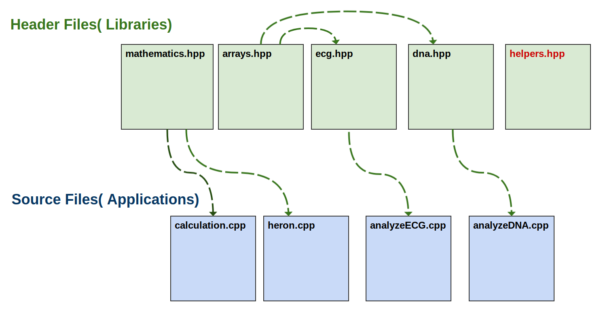

* TOC
{:toc}

## Practices and Common Issues

### Names and Scopes

#### Common Mistake: a custom type != a variable name

```c++
struct IntegerNode
{
    int data;
    IntegerNode *next;
};

struct IntegersLL
{
    IntegerNode *head;
};

int size( IntegersLL &lst )
{
    // Find mistakes
    front = IntegersLL.head;

    // Who is front?

    // Who is IntegersLL?

    // Who is IntegersLL.head?
}
```

* Don't use any name unless it is **declared**. `front` is undeclared.
* `IntegersLL` is a **type** not a **name** of a variable.

### Common Mistake: when passing by reference don't mess with input data

```c++
int size( IntegersLL &lst )
{
    // Find mistakes
    int count = 0;
    while( lst.head != nullptr )
    {
        count++;
        lst.head = lst.head->next;
    }
    return count;
}
```

### Common Mistake: Pointer to a Struct vs. Reference to a Struct vs. Name to a Struct

```c++
struct IntegerNode
{
    int data;
    IntegerNode *next;
};

struct IntegersLL
{
    IntegerNode *head;
};


int size( IntegersLL &lst )
{
    // Find two mistakes
    int count = 0;
    IntegersNode *current = lst->head;

    while( current != nullptr )
    {
        count++;
        current = current.next;
    }
    return count;
}
```

### Functions

#### Bad Practice: Global Variables

**As a rule of thumb**, inside a function, all what you have got is the function input.

```c++
struct IntegerNode
{
    int data;
    IntegerNode *next;
};

struct IntegersLL
{
    IntegerNode *head;
};

// Never do this. You are breaking the concept of a function!
IntegersLL myList;

int size( IntegersLL &lst )
{
    int count = 0;

    // This function will only work with the global variable `myList`
    // We cannot apply this function to any other Linked List of integers!
    IntegersNode *current = myList.head;

    while( current != nullptr )
    {
        count++;
        current = current.next;
    }
    return count;
}
```

The **correct** solution

```c++
struct IntegerNode
{
    int data;
    IntegerNode *next;
};

struct IntegersLL
{
    IntegerNode *head;
};

int size( IntegersLL &lst )
{
    int count = 0;
    IntegersNode *current = lst.head;

    while( current != nullptr )
    {
        count++;
        current = current->next;
    }
    return count;
}
```

#### Calling a Function

```c++
#include "linkedlist.hpp"
#include <iostream>

int main()
{
    list::IntegersLL samples;

    // Why you do this?
    std::cout << "size:" << list::size( IntegersLL &lst );

    // Or this?
    std::cout << "size:" << list::size( IntegersLL &samples );

    // We already declared samples of type list::IntegersLL
    std::cout << "size:" << list::size( samples );
}
```

### Main Function

#### Useful Application

The `main` function is the program entry point. In practice, developers build libraries over libraries, in order to be finally used in the `main` function. Recall the diagrams of **week 3**.




#### Testing Application

It is always useful to make a file with a `main` function to test the functions and structures you have just developed so:

1. You feel satisfied about what you have developed.
2. Detecting any unexpected behavior, and accordingly helps you debug your code.

Each member in a group assignment is required to make a file with a `main` function to test his/her developed functions. **Due discussion date**.

##### Advanced: Unit Testing

In practice, testing libraries is carried out in a more formal and standardized methodologies. Although it is currently an advanced topic, you can read about [Test-Driven Development (TDD)](https://en.wikipedia.org/wiki/Test-driven_development) in the summer. In C++, there are famous unit testing frameworks, for example:

* [Google Test](https://github.com/google/googletest).
* [Catch2](https://github.com/catchorg/Catch2).

## Revision on Data Structures

### Arrays

#### Dynamic Arrays

#### Static Arrays

### Linked Lists

#### Linked Lists using Pointers

#### Linked Lists using Arrays (new)

### Abstract Data Types (ADT)

#### ADT: Queue

#### ADT: Stacks

### Complexity Analysis: Big-Oh Notation

## Segmentation Fault (Core Dumped)

**Fact** Although your application did compile without errors, doesn't mean it is logically correct or should run as expected.
So far, errors in C++ development can be classified into:

1. Compilation errors.
2. Run-time errors (bugs).

    * Logical error: you don't get the expected output.
    * Critical error: you are abusing the memory access. This will result in a **crash** with an ambiguous message emitted `Segmentation fault (Code Dumped)`.

The **Segmentation fault** error typically results after:

* Dereferencing a `nullptr`.
* Dereferencing an un-initialized pointer, as a side-effect of undefined behavior.
* Dereferencing a pointer of a de-allocated place:
  * De-allocated place in stack memory after going out of scope.
  * De-allocated place in heap memory after `delete`ing that place using its pointer.
* Exceeding array boundaries.

### Memory Management and Memory Leakage

### Valgrind

#### Installing Valgrind

```terminal
sudo apt-get install valgrind
```

#### Running Valgrind

In order to trace your code to the point of the crash you need to compile your code with an additional flag `-g`. The flag `-g` tells your compiler to compiler your program in *Debugging* mode.

```bash
g++ -g -std=c++11 -Wall test.cpp -o test
```

* `-g` for debugging mode.
* `-std=c++11` to use the C++ standards of 2011.
* `-Wall` to emit any compilation warnings, very useful flag.
* `test.cpp` the source file that has a `main` function.
* `-o test` a flag for the compiler output followed by the output name of the executable.

```bash
valgrind -v --leak-check=full --show-leak-kinds=all ./test
```

## More Exercises

