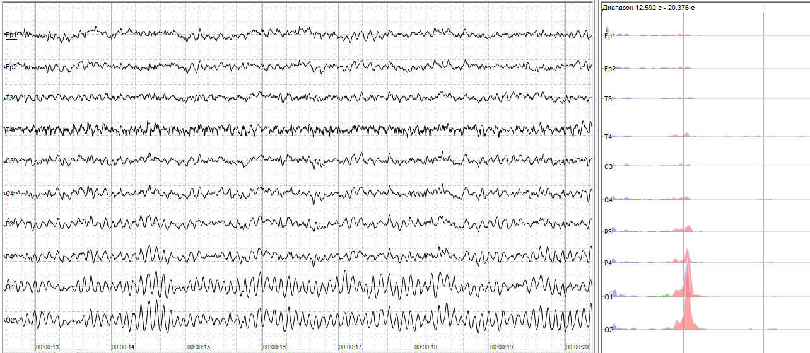

* TOC
{:toc}

## Python Basics

### Variables

Variables in python are very flexible, unlike C++:

* Interpreted language.
* No need to declare the variable type.
* The same variable can be assigned to different types.


```python
x = 5
y = 'Hello SBME'
z = 5
z = "Hello SBME"
```

### Lists

```python
# List construction
subjects = ['DSP','Computer Graphics']

# Append an element
subjects.append('Biochemistry')

# Append another list
subjects.extend(['Bioelectronics','Clinical'])

print( subjects ) # ??
print( subjects[0] ) # ??
print( subjects[1] ) # ??
```


### Arithmetic Operations

```python

x = 19
y = 18 

z = x / y
z = x * y
z = x + y
z = x - y

```

### Logical Opertations

```python
x = 17 % 2 == 1

y = 9 / 3 < 1 

b = x or y ## True

b = x and y ## False
```

- `and` => `&&` in C++ 

- `or` => `||` in C++

### If, elif, else

```python 

x = 23 
y = 22 

if x < y:
  z = 13 # Local scope

elif x % 2 == 1 and x > y :
  h = 17 # Local scope

else:
  v = 80 # Local scope

print( z ) # Error: z is out of scope
print( h ) # Error: h is out of scope
```

### Loops

```python

for i in range(10):
  print( i )

i = 0
while i < 10 :
  print( i )
  i += 1
```


### Functions

```python
def mean( list ):
  sum = 0
  for element in list:
    sum += element
  return sum / len( sum )

m = mean([1,12,42,1,23,12])
print( m )
```


### Importing Libraries

```python 
import numpy as np
import scipy as sp
```


### Numpy

Reference: [NumPy Reference](https://docs.scipy.org/doc/numpy-1.13.0/reference/#numpy-reference)

```python
import numpy as np

a = np.array([12,23,44,21,23])

print( np.mean( a ))
print( np.std( a ))
```


### Scipy & Matplotlib

```python
from scipy import signal
import matplotlib as mpl
import matplotlib.pyplot as plt
import numpy as np

sig = np.repeat([0., 1., 0.], 100)

highpass = [-1,0,1]
hanning = signal.hann(50)

filtered_hanning = signal.convolve(sig, hanning)
filtered_highpass = signal.convolve(sig, highpass)


## Plotting

mpl.style.use('seaborn')

plt.figure(1)
plt.subplot(311)
plt.plot( sig , lw = 2 )

plt.subplot(312)
plt.plot( filtered_highpass , lw = 2 )

plt.subplot(313)
plt.plot( filtered_hanning , lw = 2 )
```

### Plotly - Dash

* Web based visualization.
* Many features.
* Declarative Style.
* Web-based visualization.

#### Declarative Programming

This snippet is from [Dash by plotly](https://plot.ly/products/dash/)

```python
import dash
from dash.dependencies import Input, Output
import dash_core_components as dcc
import dash_html_components as html
from pandas_datareader import data as web
from datetime import datetime as dt

app = dash.Dash()

app.layout = html.Div([
    html.H1('Stock Tickers'),
    dcc.Dropdown(
        id='my-dropdown',
        options=[
            {'label': 'Coke', 'value': 'COKE'},
            {'label': 'Tesla', 'value': 'TSLA'},
            {'label': 'Apple', 'value': 'AAPL'}
        ],
        value='COKE'
    ),
    dcc.Graph(id='my-graph')
])

@app.callback(Output('my-graph', 'figure'), [Input('my-dropdown', 'value')])
def update_graph(selected_dropdown_value):
    df = web.DataReader(
        selected_dropdown_value, data_source='google',
        start=dt(2017, 1, 1), end=dt.now())
    return {
        'data': [{
            'x': df.index,
            'y': df.Close
        }]
    }

if __name__ == '__main__':
    app.run_server()
```


## Signals: Examples

### Electrocardiography (ECG)


### Electroencephalography (EEG)



[CC BY-SA 4.0](https://creativecommons.org/licenses/by-sa/4.0) (by *Andrii Cherninskyi*)


## Task Objective

* Signal Viewer Application.
* 3 Signals X 3 Cases.
* Live sound signal visualization from Microphone.
* Matlab or Python Implementation.
* Apply filters on your signal (convolution).
* User designed filters (windows).


## Getting Started with Python: Installing Anaconda

### Anaconda

* Shipped +1000 Data Science Packages (DSP, Machine Learning, AI, Statistics).
* Shipped with Python IDE (Spyder).
* Shipped with Jupyter Notebook.

[Download Anaconda 3 (Python 3)](https://www.anaconda.com/download)

