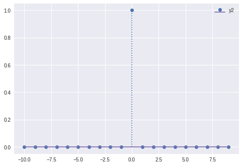
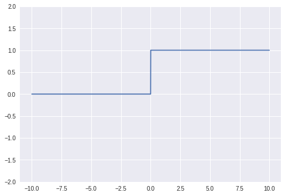
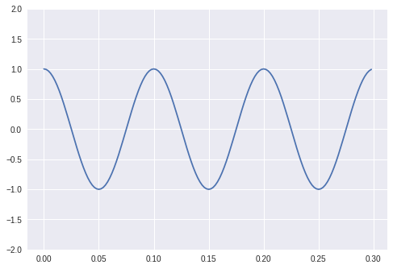
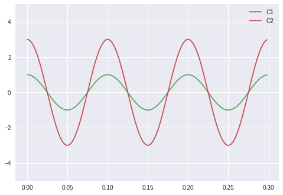
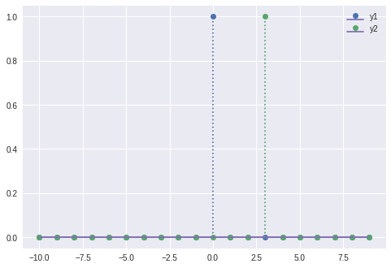
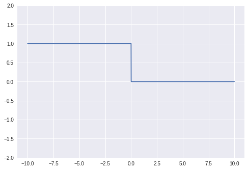
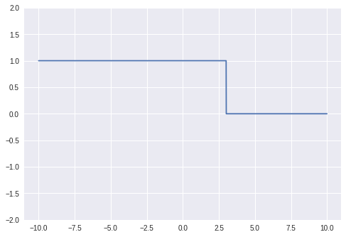

> These notes are inspired by slides made by *T.A Aya Fawzy*, 2015.

## Basic Signals

### Impulse Function (Dirac)

$$\delta(x) = \left\{
        \begin{array}{ll}
            \infty & \quad x = 0 \\
            0 & \quad x \neq 0
        \end{array}
    \right.$$

```python
def impulse(x):
    return 1 * (x == 0)

ts = np.arange(-10,10,1)
impulse_sig = impulse( ts )
stem( ts, impulse_sig )
```



### Plotting Signals

```python
def plot( t , y ):
    fig = plt.figure()
    ax = fig.gca()
    ax.set_ylim((-2, 2))
    ax.grid(True)

    plt.plot( t , y )

def plot2( t , y1 , y2 ):
    fig = plt.figure()
    ax = fig.gca()
    ax.set_ylim((-5, 5))
    ax.grid(True)

    plt.plot( t , y1 , 'C1', label='C1' )
    plt.plot( t , y2 , 'C2', label='C2')
    plt.legend()

def stem( t , y1 ):

    markerline, stemlines, baseline = plt.stem(t, y1, markerfmt='o', label='y2')
    plt.setp(stemlines, 'color', plt.getp(markerline,'color'))
    plt.setp(stemlines, 'linestyle', 'dotted')

    plt.legend()
    plt.show()


def stem2( t , y1 , y2 ):
    markerline, stemlines, baseline = plt.stem(t, y1, markerfmt='o', label='y1')
    plt.setp(stemlines, 'color', plt.getp(markerline,'color'))
    plt.setp(stemlines, 'linestyle', 'dotted')

    markerline, stemlines, baseline = plt.stem(t, y2, markerfmt='o', label='y2')
    plt.setp(stemlines, 'color', plt.getp(markerline,'color'))
    plt.setp(stemlines, 'linestyle', 'dotted')

    plt.legend()
    plt.show()
```

### Unit Step Function (Heaviside)

$$\mathcal{H(x)} = \left\{
        \begin{array}{ll}
            0 & \quad x \leq 0 \\
            1 & \quad x > 0
        \end{array}
    \right.$$

```python
def step(x):
    return 1 * (x > 0)

ts = np.arange(-10,10,0.01)
step_sig = step( ts )
plot( ts , step_sig )
```



### Sinusoids

```python
def periodic_signal( freq , amp , func ):
    ts = np.arange( 0 , 0.3 , 1 / (50 * freq) )
    phases = 2 * np.pi * freq * ts 
    ys = amp * func( phases )
    return ts , ys

def sin_signal( freq , amp ):
    return periodic_signal( freq, amp, np.sin )

def cos_signal( freq , amp ):
    return periodic_signal( freq, amp, np.cos )
```

### Cosine and Sine

```python
fig = plt.figure()
ts  ,cos_sig = cos_signal( 10 , 1 )
plot( ts, cos_sig )
```



```python
fig = plt.figure()
ts  ,sin_sig = sin_signal( 10 , 1 )
plot( ts, sin_sig )
```

## Basic Operations

### Scaling

```python
ts  ,cos_sig = cos_signal( 10 , 1 )
cos_sig_scaled = 3 * cos_sig 
plot2( ts, cos_sig , cos_sig_scaled )
```



### Time Shifting

```python
ts = np.arange(-10,10,1)
impulse_sig = impulse( ts )
impulse_sig_shifted = impulse( ts - 3 )
stem2( ts, impulse_sig , impulse_sig_shifted)
```



### Time Reversal (Mirroring)

```python
ts = np.arange(-10,10,0.01)
step_sig = step( -ts )
plot( ts , step_sig )
```




### Time Reversal + Shifting

```python
ts = np.arange(-10,10,0.01)
step_sig = step( -(ts-3))
plot( ts , step_sig )
```



## DSP General Scheme


## Sampling: Motivation

* Analog signal contains an infinite number of points.
* The infinite points cannot be processed by computer, since they require:

  * Infinite amount of memory.
  * Infinite amount of processing power for computations.

* Sampling can solve such a problem by taking samples at a fixed time interval or sampling period T.

## Sampling: Definition


## Uniform Sampling


$$ p(t) = \sum_{n=-\infty}^{\infty} \delta( t - nT ) $$

## Task1 Requirement 1: Sampling Sinusoids and Exponential

Plot several sinusoids and exponential signals from nature, then show the sampled version of these signals.

* Python Implementation.
* Plotly, or Plotly-Dash is a plus.
* Porting your implementation on the cloud (github) is a plus.

## Task1 Requirement 2: Listening to Sinusoids

Generate a sound signal composed from different sinusoids, and other from mixture of sinusoids and exponentials.

Recommended watching and reading:

* 
* 

## Effect of Phase Shift

What is the effect of adding two sinusoids with different
phase shift?

## Aliasing


## Nyquist Criterion


$$ f_{\text{sampling}} \geq 2f_\text{max} $$

## Convolution: Definition

* Convolution plays an important role in digital filtering.
* Convolution notation $$y(n) = x(n) * h(n)$$
* Convolution formula $$y(n) = \sum_{n=-\infty}^{\infty} x(n) h( n - k )$$

> From [Wikipedia](https://en.wikipedia.org/wiki/Convolution)


## Textbook Problems

### Example

Let $$ f = \big[1,4,2,5 \big] $$, $$ g = \big[3, 4, 1\big]$$
Estimate the convolution version of $$c = f * g$$

Solution:

## Task 2: Migrating your Latest Task to Plotly

Migrate a simplified version of signal viewer task of last week, from MATLAB to Python. Also, **integrate task 1 of this week into your GUI**.

**Deadline Wednesday of 28 Fubruary.**

## Code Snippets

```terminal
git clone https://github.com/sbme-tutorials/sbe309-week2-demo.git
```

## References


