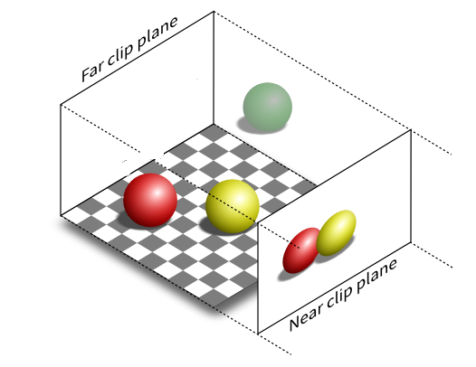
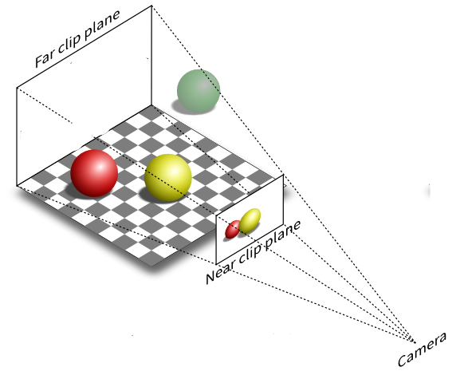
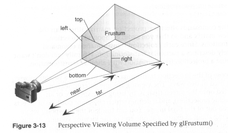
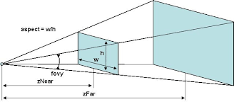

---
# You don't need to edit this file, it's empty on purpose.
# Edit theme's home layout instead if you wanna make some changes
# See: https://jekyllrb.com/docs/themes/#overriding-theme-defaults
layout: page
category: "notes"
course: "sbe306"
year: "2019"
title: "Projection"
---

* TOC
{:toc}

## Projection 

3D projection is mapping a 3 dimensional points to a 2D plane. 

### Types of projection

1. Parallel Projection (Orthogonal)

It preserves the parallelism where parallel lines still parallel by just dropping the Z dimension

$$
\begin{bmatrix}
x' \\ y' \\ 0 \\ 1
\end{bmatrix}

= 

\begin{bmatrix}
1 & 0 & 0 & 0 \\ 
0 & 1 & 0 & 0  \\ 
0 & 0 & 0 & 0\\ 
0 & 0 & 0 & 1 
\end{bmatrix}

\begin{bmatrix}
x \\ y \\ z \\ 1
\end{bmatrix}

$$



2. Perspective Projection

It does not preserve parallelism due to that parallel lines will converge to a single point (Vanishing point).

In perspective projection nearer objects are larger and further are smaller. 




$$
x' = x * Z_{near} / Z_{far}
$$


$$
y' = y *   Z_{near} / Z_{far}
$$


$$
z' =  Z_{near}
$$

Think of at as a scaling transformation. 

$$
\begin{bmtarix}
\frac{f}{aspect} & 0 & 0 & 0 \\
0 & f & 0 & 0 \\
0 & 0 & \frac{Z_{far} + Z_{near}}{Z_{far} - Z_{near}} & \frac{2 * Z_{far} * Z_{near}}{Z_{far} - Z_{near}} \\
0 & 0 & -1 & 0 \\
\endb{bmatrix}
$$

**Defining Projection Plane**

To identify the projection plane you have to define its width, hight, near and far projections.

To Do that in OpenGL you have two ways 

1. Using glFrustum

```c
void glFrustum(	GLdouble left,
 	GLdouble right,
 	GLdouble bottom,
 	GLdouble top,
 	GLdouble nearVal,
 	GLdouble farVal);
```



2. Using glPerspective


```c
void gluPerspective(	GLdouble fovy,
 	GLdouble aspect,
 	GLdouble zNear,
 	GLdouble zFar);
```



## Defining Camera Coordinates

We can define the camer coordintes in OpenGL using 

```c
void gluLookAt(	GLdouble eyeX,
 	GLdouble eyeY,
 	GLdouble eyeZ,
 	GLdouble centerX,
 	GLdouble centerY,
 	GLdouble centerZ,
 	GLdouble upX,
 	GLdouble upY,
 	GLdouble upZ);
```


**Note:**

 For up direction we care about the sign (Direction of the vector).


## Pipeline 

Assembly line from set of vertices to set of pixels (image).


The pipeline simply includes 

1. 3D Modeling (Primitives or vertices) **Model (World Coordinates)**

2. Lightening and coloring calculations 

3. Transform to 3D camera coordinates **View (Camera Coordinates)**

4. Clip to 2D Screen coordinates **Projection (Sceen Coordinate)**


## Demo 

## Animation Using timer function 