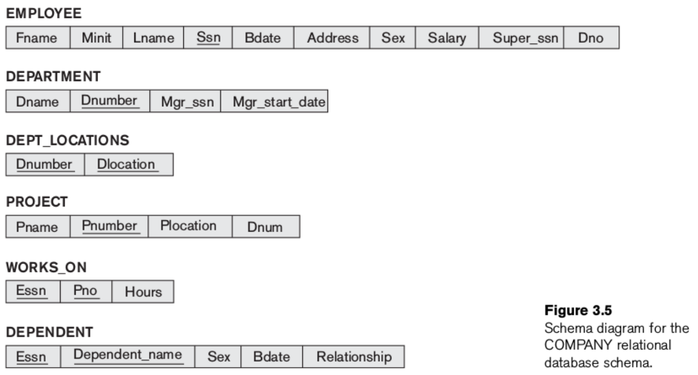

---
# You don't need to edit this file, it's empty on purpose.
# Edit theme's home layout instead if you wanna make some changes
# See: https://jekyllrb.com/docs/themes/#overriding-theme-defaults
layout: page
category: "notes"
course: "sbe306a"
year: "2019"
---
* TOC
{:toc}

# Tutorial 4
learning more about data types beside more features.

## Strings

String defined between single quotes in standard SQL

```
SELECT  ' I Love BIO2020';
or
SELECT  " I Love them even more";
```

Length of string

```
SELECT LENGTH(column_name) AS ----- FROM table_name;
```

substring function to select part of string used to process dates saved as strings

```
SELECT SUBSTR(string,start,length);
```

input processing from user to ensure reliability by removing spaces 

```
SELECT TRIM('   BIO2020     ');
```

there is also left trim **LTRIM** and right trim **RTRIM** to remove space in left /right only.

NOTE: **UPPPER and  LOWER** function used to standardize text for similarity.

## Nummeric type ( INTEGER and REAL)

INTEGERS types:

1. INTEGER (precision)
2. DECIMAL (precision, scale)
3. MONEY (precision,scale)

REAL types:

1. REAL (precision)
2. FLOAT (precision)

Checking type of data or expression using **TYPEOF**.

To cast value use **CAST(data,new_type)** eg CAST(1,REAL) gives 1.0 .

Integer Division using modulus **%** operator.

**ROUND(value,no_digits)** to round real values.

## DATES and TIMES

Dates and times have specific proprieties they are represented in std format with most significant parts to left **2018-02-18 16:45:13** corresponding to UTC time.

special types : optimized for dates and times calculations.

1. DATE
2. TiME
3. DATETIME
4. YEAR
5. INTERVAL

example: used to get the current time used in logins and tracking insertions

```
SELECT DATETIME('now')
```
we can use **DATE or TIME** instead of DATETIME.

see the standard library of mysql.

## Transaction

in standard SQL transaction is  a group of operations handled as one unit of works but if any of the operations fails all the transaction fails and the database 
for example.

```
START TRANSACTION;
    INSERT table1
    INSERT table2
    UPDATE table3
    UPDATE table4
COMMIT;
```
it may start with **BEGIN WORK** and ends with either **COMMIT** or **ROLLBACK**.

inserting into more than one table at same entry  significantly improves reliability and performance.

note: ROLLBACK return the database table without committing changes to tables.

## Triggers

Trigger is a certain action activated when a certain condition is satisfied.

```
CREATE TRIGGER trigger_name AFTER/BEFORE INSERT/UPDATE/DELETE ON table_name
BEGIN
        SQL statement
END;
```

like inserting current data with every transaction made.

example:

```
CREATE TABLE transact (
    id INT NOT NULL,
    tr_date DATETIME ,
    associated_person VARCHAR(50)
);

CREATE TRIGGER insert_date AFTER INSERT ON transact
FOR EACH ROW  SET NEW.tr_date = NOW();

```

for multiple statements within trigger use **BEGIN --- END** after **FOR EACH ROW**

## Selection views

enable us to save a select statement from one or more tables as view so we can call it as a separate table later.

```
CREATE VIEW v AS SELECT column1, column2 .... FROM t;

SELECT * FROM v
```

## Exercises
Regard the following Relational model



### Cross Product

**Q1** Retrieve employees names who are working in the Research department

```
Select FNAME,LNAME
from employee,department
where DNO = DNUMBER and DNAME = 'Research'
```

**Q2** Retrieve project names where the last name of the department manager is Wong

```
Select PNAME
from employee,department,project
where DNUM = DNUMBER and MGRSSN = SSN
and LNAME = ‘Wong’
```

**Q3** Retrieve managers names having projects in 'Stafford'

```
Select FNAME,LNAME
from employee,department,project
where DNUM = DNUMBER and MGRSSN = SSN and Plocation = ‘Stanfford’
```

### Nested queries

**Q1** Retrieve project names where the department manager last name is Wong or project names where employee smith is working in.

```
Select PNAME
from project
where PNUMBER in
(Select PNUMBER from employee
join department on MGRSSN = SSN
join project on DNUM = DNUMBER
where LNAME = ‘Wong’ )
or PNUMBER in (Select PNUMBER from employee
join works_on on ESSN = SSN
join project on PNO = PNUMBER
where LNAME = ‘Smith’ )
```

**Try to solve the following**

1. Retrieve the names of all employees in ‘Research’ department who work
more than 10 hours per week on theProductX project.

2. List the names of all employees who have a dependent with the same first
name as themselves.

3. For each project, list the project name and the total hours per week (by all
employees) spent on that project.

4. Retrieve the names of all employees who do not work on any project.