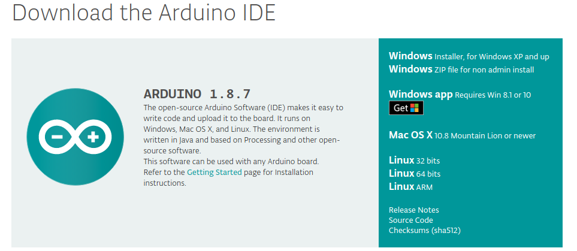
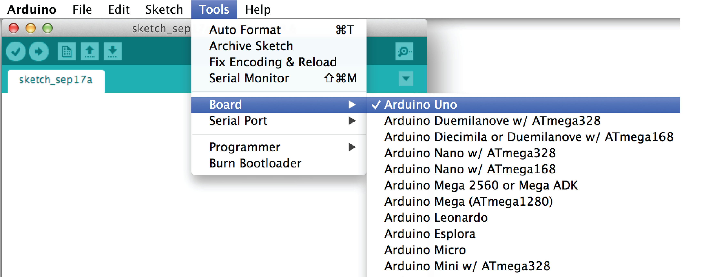
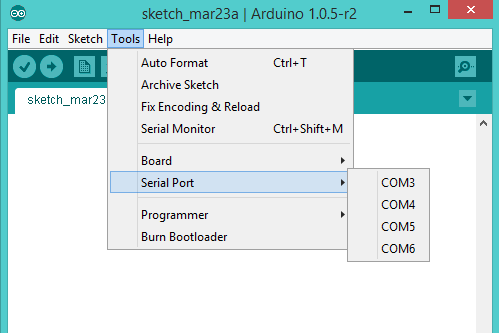

---
# You don't need to edit this file, it's empty on purpose.
# Edit theme's home layout instead if you wanna make some changes
# See: https://jekyllrb.com/docs/themes/#overriding-theme-defaults
layout: home
category: "coursepage"
course: "hemn115"
year: "2019"
---
# Introduction to BME

Instructor : Dr. Tamer Yousef

Demonstrator : Eng. Eslam Adel 

email: `eslam.a.mahmoud@eng1.cu.edu.eg`

---
* TOC
{:toc}

## Course Outlines
* Collection of different disciplines in Biomedical Engineering
* Building the big picture 
* Expected topics : 
    * Embedded systems and Instrumentations
    * Biomechanics and Rehabilitation
    * Bio-signal Processing 
    * Medical imaging and visualization 
    * Bioinformatics
    * Hospital information system 
    * Virtual Reality in BME

## Microcontroller and Embedded systems

### Introduction 
* Small computer on a single IC (integrated circuit)
* System on chip (SOC) 
    * CPU 
    * Memory 
    * Peripherals interfacing with environment
* Found in all electronic devices


### Arduino 
 * Open source easy to use electronics Hardware and Software platform
 * Arduino Uno Board
 
    * Atmega328 microcontroller
     
    * 14 I/O Digital pins (6 PWM)
    * 6 Input pins (Analog)
    * Clock speed 16 MHz
    * Flash memory 32 KB
    * USB port for programming
* Other boards (Mega , Nano, Leonardo)

### Arduino IDE 
* Installing IDE [link](https://www.arduino.cc/en/Main/Software)



* Selecting Board 



* Identifying Serial port



* Blinking Example

```c
int ledPin = 13; // LED connected to digital pin 13

// The setup() method runs once, when the sketch starts
void setup()
{
pinMode(ledPin, OUTPUT); // initialize the digital pin as an output
}
// the loop() method runs over and over again,
void loop()
{
digitalWrite(ledPin, HIGH); // turn the LED on
delay(1000); // wait a second
digitalWrite(ledPin, LOW); // turn the LED off
delay(1000); // wait a second
}
``` 

### Sketch structure 
* setup function 
 * Executed one time 
 * For configuration (pins, serial communication)

* loop function 
 * Operating system
 * Execute forever 

### Variables 

 * Variables in C/C++ have different data types 
 * For example byte is 8 bit variable with value from 0 to 255
 * Other data types int, unsigned int, float , char, .... etc

 ```c
 int myVariable; //Define a variable myVariable with type int 
 ```
 * array is a group of values

 ```c 
 int a[10]; //Array of 10 integers
 ```

### Constants 

 * Predefined variables
 * Example HIGH, LOW, INPUT, OUTPUT

### Functions 

* subroutine that encapsulate some calculations
* Builtin functions 

```c
pinMode(pin, mode);
digitalWrite(pin);
analogRead(pin);
delay(ms);
```
* User defined functions 
    * [type] [name](parameters)

    ```c
    int add(int x, int y)
    {
        int z = x + y;
        return z;
    } 
    ```

### Control structures 

* Branching due to a condition
    * if 
    * if, else 
    * switch , case

  example

  ```c
/*
Pushbutton sketch
a switch connected to pin 2 lights the LED on pin 13
*/
const int ledPin = 13; // choose the pin for the LED
const int inputPin = 2; // choose the input pin (for a pushbutton)
void setup() {
pinMode(ledPin, OUTPUT); // declare LED pin as output
pinMode(inputPin, INPUT); // declare pushbutton pin as input
}
void loop(){
int val = digitalRead(inputPin); // read input value
if (val == HIGH) // check if the input is HIGH
{
// do this if val is HIGH
digitalWrite(ledPin, HIGH); // turn LED on if switch is pressed
}
else
{
// else do this if val is not HIGH
digitalWrite(ledPin, LOW); // turn LED off
}
}
```
* Looping
    * for loop : for defined number of Instrumentations
    * while loop : based on condition

example

```c
/*
ForLoop sketch
demonstrates for loop
*/
void setup() {
Serial.begin(9600);}
void loop(){
Serial.println("for(int i=0; i < 4; i++)");
for(int i=0; i < 4; i++)
{
Serial.println(i);
}
}
```
* others 
 * break : skip remaining iterations
 * continue : skip current iteration
 * return : Back from a function
 * void : nothing

### Serial communication

* Communication between arduino and computer or any other devices
* Tx for transmission and Rx for receiving
* Functions : 
    * Serial.begin(speed)
    * Serial.print() , Serial.println()
    * int Serial.read()
    * int Serial.available() 

```c
/*
* SwitchCase sketch
* example showing switch statement by switching on chars from the serial port
*
* sending the character 1 blinks the LED once, sending 2 blinks twice
* sending + turns the LED on, sending - turns it off
* any other character prints a message to the Serial Monitor
*/
const int ledPin = 13; // the pin the LED is connected to
void setup()
{
Serial.begin(9600); // Initialize serial port to send and receive at 9600 baud
pinMode(13, OUTPUT);
}
void loop()
{
if ( Serial.available()) // Check to see if at least one character is available
{
char ch = Serial.read();
switch(ch)
{
case '1':
blink();
break;
case '2':
digitalWrite(ledPin,HIGH);
break;
case '3':
digitalWrite(ledPin,LOW);
break;
default :
Serial.print(ch);
Serial.println(" was received but not expected");
break;
}
}
}
void blink()
{
digitalWrite(ledPin,HIGH);
delay(500);
digitalWrite(ledPin,LOW);
delay(500);
}
```
## Git Version Control System


### Introduction 

* Backup strategy from disk crash 
* Archive all work 
* Collaboration and team work.
* Version control system 
  * Access historical editions 
  * Recover all changes 
  * Know who did that when.
* Linus Travolds established git version control system 
* Parallel, independent and simultaneous development
  * Centralized repository server 
  * Branching and easy merging
* Other version control systems : Bitkeeper, svn , murcurial 

### Getting started

* Installation : Available on windows, linux and mac OS.
* Download and install [here](https://git-scm.com/downloads)
* Basic Cycle 
 * Create / Clone your repository 
 * Add files
 * Commit changes 
 * Update your local version 
 * Publish your work

### Configuration 

```bash 
git config --global user.name "You Name"
git config --global user.email "you Email"
```

### Git cycle

* Create a new repository 

```bash
git init
```
* Or Clone existed repository 

```bash
git clone repoLink
```

* Add your files 
```bash
git add file
```
* Show status 
```bash
git status 
```
* Commit your changes 
```bash
git commit -m "Say a message"
```
* Update your local repository 
```bash
git pull origin master
```
* Publish your work
```bash
git push origin master
```
* Show changes 
```bash
git log
git show 
```

### [Github](www.github.com) 

Hosting service for Git version control system. 
