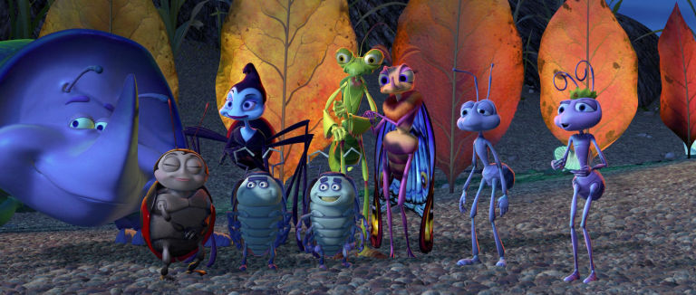
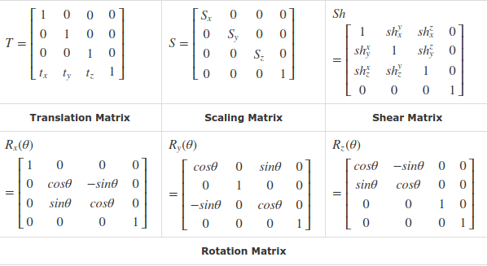
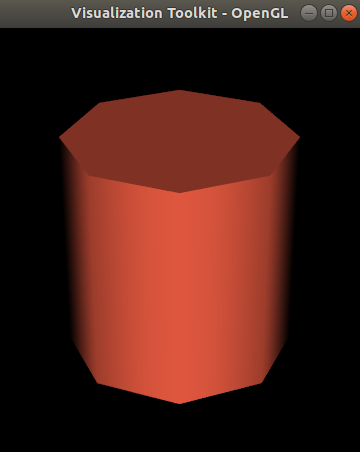
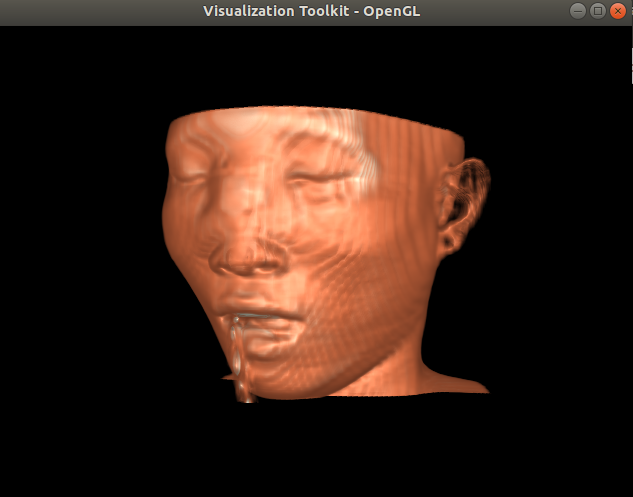

---
# You don't need to edit this file, it's empty on purpose.
# Edit theme's home layout instead if you wanna make some changes
# See: https://jekyllrb.com/docs/themes/#overriding-theme-defaults
layout: page
category: "notes"
course: "hemn115"
title:  "Week 1: Medical Imaging and Visualization"
year: "2019"
by: "Eslam"
---

* TOC
{:toc}

## Computer Graphics 

### Interesting applications

Animation film production is on of the interesting applications of computer graphics. All characters, scenes, figures are generated by the computer in a 3D world in the computer and displayed in the 2D display. 




Also cinema production now is highly adapted using visual effects and computer graphics. You was tricked most of interesting scenes you enjoyed watching was not real. It was generated by computer graphics. 


Computer games are another story it is based on computer graphics adding to it control and interactivity element. 


This application are very interesting. But for us as a biomedical engineers we can harness the power of computer graphics in more important applications and improve human life. 

Medical applications include Image guided therapy, Treatment planing, modelling and simulation. 


### Computer Graphics basics

The studying of computer graphics requires many skill. First of all Math 

All operation of object positioning and transformation are just mathematical computations. Lightening the scene, simulating different material properties is also includes math. 

For example transformation matrices are the key of moving, rotating, and scaling object in the 3D coordinates.

Projection matrix is responsible for transforming 3D world to 2D display coordinates to be visualized on the screen. Phong equation is the model that control lightening of the scene. 



**Phong Equation**


Computer skills in general are required. You must have the knowledge of different computer science fields like, algorithms and data structures, Graphics languages, GPU programming and many other tools. 

Computer graphics is a state of art. You must have the sense of imagination and creativity.  

## Visualization Toolkit (VTK)


### Brief Introduction 

VTK is an open source packages or libraries for 3D Computer graphics, image processing, and visualization. There is a difference between software program and software library or package. Program is a set of instruction to tell the computer to do something. But a package or a library is set of files used to make an application. 

We will use VTK library to make an application as it is not an application or program itself. 

### Installation and testing

We will use VTK python library. The conventional way to install VTK is to download the source code and build it to install the library using another program called CMake. This method is quite complex and it mainly used if we need to use VTK with different languages C++, Python, Java, ..., etc.

The alternative way we will use is so simple. Only two steps to install VTK and Python. 

1. Installation of Anaconda 


 Anaconda is a cross platform distribution that aims to simplify managing and installation of development packages. You can download and install it easily from [here](). 
 
 Anaconda comes with many useful package for data science. Also it comes with [Spyder](https://www.spyder-ide.org/) IDE for python development. 

 IDE is an abbreviation of integrated development environment. It just the environment that you will develope your code, run and view output using it. 
 

2. Install VTK package using anaconda prompt or command

After installation of anaconda you will have an application called anaconda prompt. Just open it and type this simple command 

```bash
conda install -c conda vtk
```

Accept the installation. Packages will be downloaded and installed on your computer and that is it. 

### Simple Example 

Now open Spyder ide to start playing with some codes. To make sure that your installation of VTK library was successful create a new file to add this few lines of code and run the example
```python
# This simple example shows how to do basic rendering and pipeline
# creation.
 
import vtk
# The colors module defines various useful colors.
from vtk.util.colors import tomato
 
# This creates a polygonal cylinder model with eight circumferential
# facets.
cylinder = vtk.vtkCylinderSource()
cylinder.SetResolution(8)
 
# The mapper is responsible for pushing the geometry into the graphics
# library. It may also do color mapping, if scalars or other
# attributes are defined.
cylinderMapper = vtk.vtkPolyDataMapper()
cylinderMapper.SetInputConnection(cylinder.GetOutputPort())
 
# The actor is a grouping mechanism: besides the geometry (mapper), it
# also has a property, transformation matrix, and/or texture map.
# Here we set its color and rotate it -22.5 degrees.
cylinderActor = vtk.vtkActor()
cylinderActor.SetMapper(cylinderMapper)
cylinderActor.GetProperty().SetColor(tomato)
cylinderActor.RotateX(30.0)
cylinderActor.RotateY(-45.0)
 
# Create the graphics structure. The renderer renders into the render
# window. The render window interactor captures mouse events and will
# perform appropriate camera or actor manipulation depending on the
# nature of the events.
ren = vtk.vtkRenderer()
renWin = vtk.vtkRenderWindow()
renWin.AddRenderer(ren)
iren = vtk.vtkRenderWindowInteractor()
iren.SetRenderWindow(renWin)
 
# Add the actors to the renderer, set the background and size
ren.AddActor(cylinderActor)
ren.SetBackground(0.0, 0.0, 0.0)
renWin.SetSize(200, 200)
 
# This allows the interactor to initalize itself. It has to be
# called before an event loop.
iren.Initialize()
 
# We'll zoom in a little by accessing the camera and invoking a "Zoom"
# method on it.
ren.ResetCamera()
ren.GetActiveCamera().Zoom(1.5)
renWin.Render()
 
# Start the event loop.
iren.Start()
```

And this is the output of this example



Don't Worry you don't need to know what is the meaning of each line of the code. I will overview the most important things right here. 

1. Tell the computer to use vtk library
```python
import vtk
```
Using this line of code I am telling the computer that "Hey, please I want to use vtk library that I have installed" 

2. Creating a model 

```python 
cylinder = vtk.vtkCylinderSource()
cylinder.SetResolution(8)
```
I am here asking the computer to create a cylinder model with 8 faces. I can control number of faces of the model lets try to change it and see what will happen. 

3. Make an actor 
```python 
cylinderActor = vtk.vtkActor()
```

The actor is the object that will be rendered. 

4. Make a renderer 
```python 
ren = vtk.vtkRenderer()
renWin = vtk.vtkRenderWindow()
```
The renderer will use that actor of that source to create the scene on the rendering window. 

5. Now start rendering
```python
renWin.Render()
```

**Try to change given values. What will happen ?**


## Task 1 Using VTK



### Task description
In this task you will learn how to use VTK to reconstruct 3D model of human from many 2D images. You also will learn how to use some filtering and processing techniques to manipulate the data and visualize it in different ways. 

### Requirements

In this task you are required to install VTK on your computer. Load volume dataset and render it on an interactive window. You also asked to change visualization parameter for example change the color and opacity of different tissues and report the results of your manipulations. 

### Bonus 

Human skull dataset will be provided for you. There will be more credit for students who will use another medical dataset besides the human skull that will be provided. 

## Rules and regulations

This task is an individual assignment. All students have to submit their own solutions to this assignment. Task will be hosted on the github. Task link will be posted on the course page. Please read the task statement carefully when posted. 

## Useful links