---
# You don't need to edit this file, it's empty on purpose.
# Edit theme's home layout instead if you wanna make some changes
# See: https://jekyllrb.com/docs/themes/#overriding-theme-defaults
layout: page
category: "notes"
course: "hemn115"
title:  "Week 4: Hardware"
year: "2019"
by: "Eslam"
---

* TOC
{:toc}

## Hardware 

Electric charges which is positive or negative move to produce electricity. Its movement is associated with the generation of electric field and the process is reversed. 

Two main components are associated with electricity current and voltage (I and V)

current is measured in ampere or mA. Voltage is measured in Volts or mV

### Circuits and Electronics 

Electric circuit is a closed path that current flow through it. It contains different electrical components


* Resistor / Potentiometer (Variable resistor)
Ohm or kilOhm


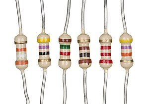


* Capacitors 

Farad or micro Farad

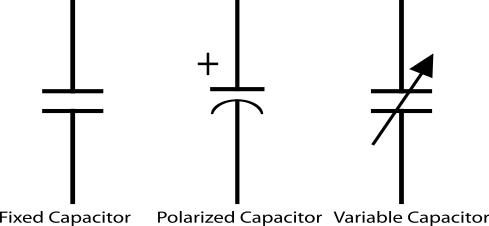

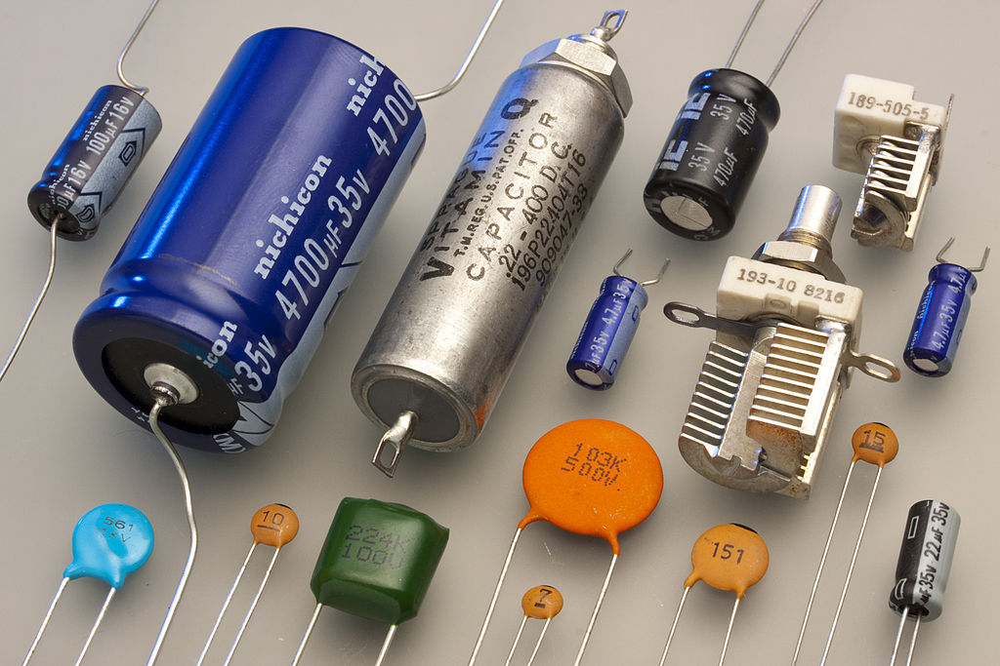


* Inductor or Transformers
Henry (H) 


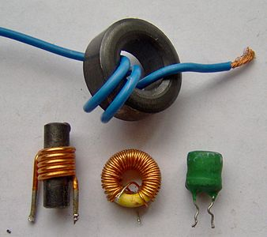

* Switches

Break or connect circuit 

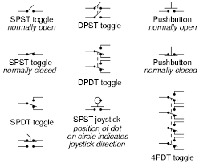

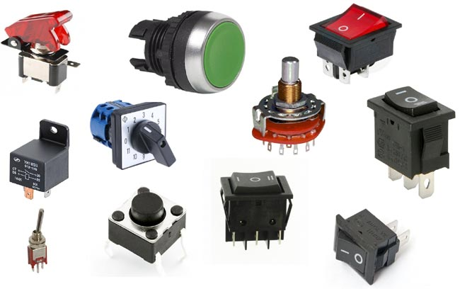


* semiconductor (Electronics)
   
    * Diodes
   
        Current move in one direction and prevented in the other direction
    
        
        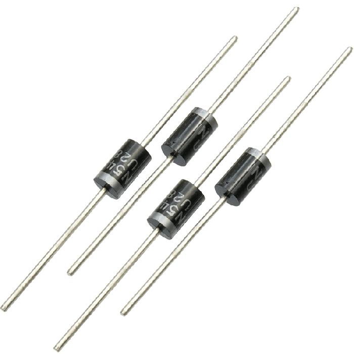

        

        
        
    
        
    
         
    
        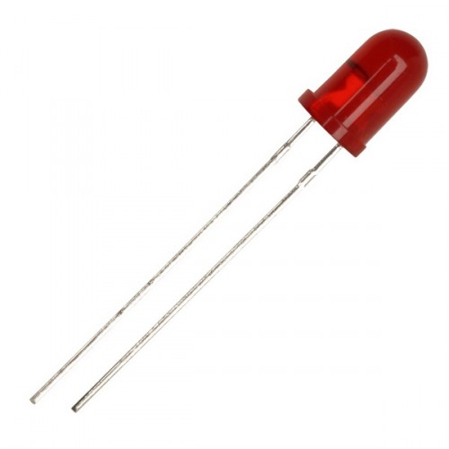
    
        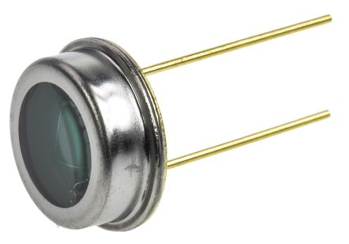

    * Transistors
    
    3 Terminals component. Used in signal amplification switches Digital circuits
    
    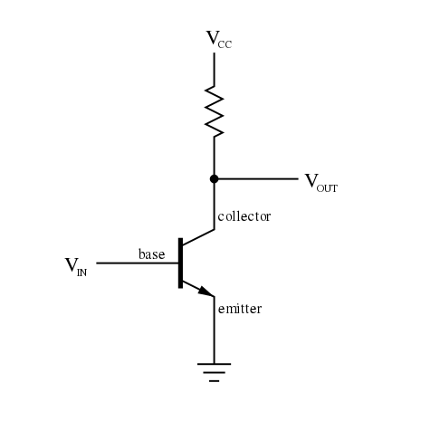


    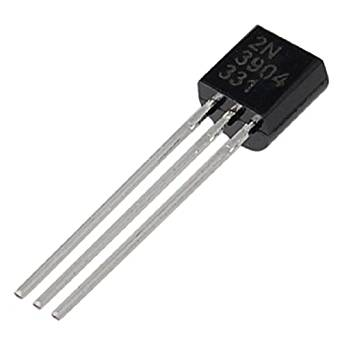

    * Integrated circuits
    
        contains huge number of transistors and logic circuits

        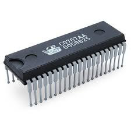
        
        


* Wires and connectors 
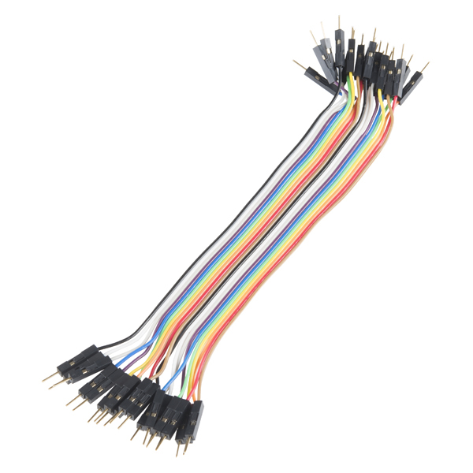


* Boards
    * Bread board
    
    
    
    * Printed circuit board
    
    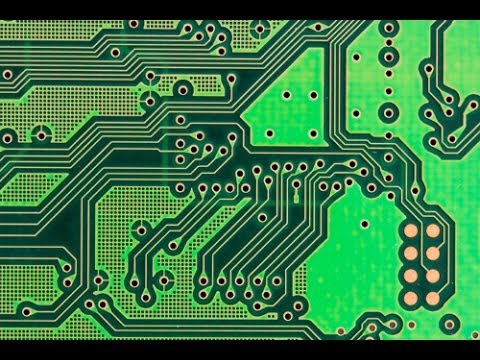

    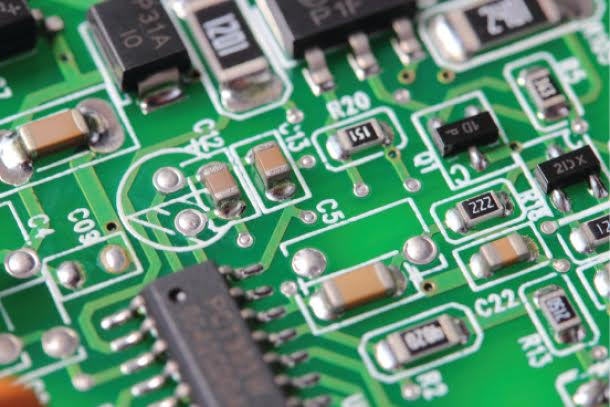
 


### Measurement Instruments

* multi-meter 

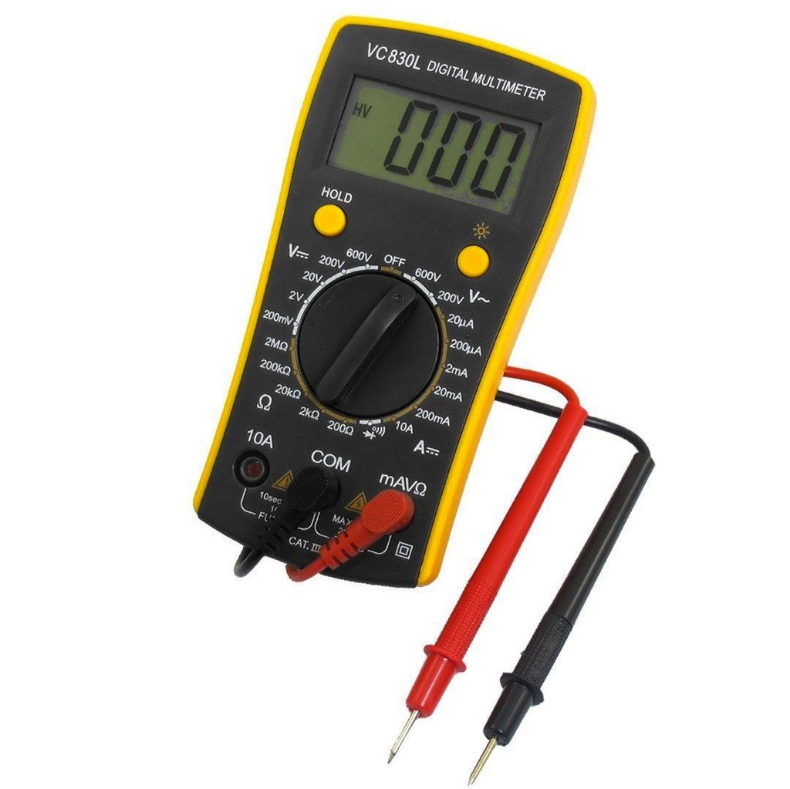

* function generator

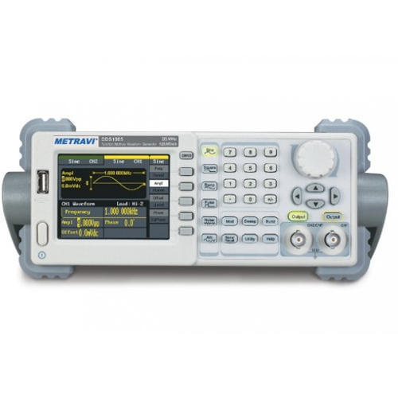

* oscilloscope

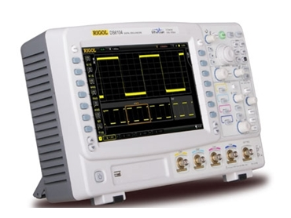


## Signal 


Varying voltage over time 

World is continuos or analog but We have limited memory to store signal value continuously. So we need to make it limited or digital. We need to sample the signal to get a good representation of the signal. 
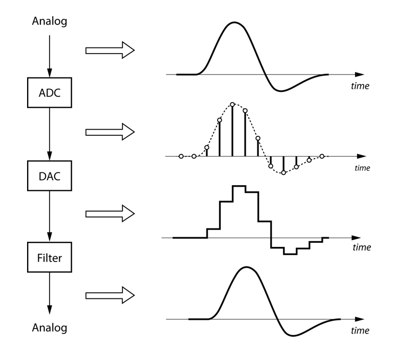

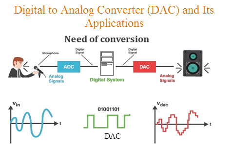

## Arduino Programming 
Arduino is programmed using C++ language. It is already equipped with essential built in function to handle simple interfacing with electronic devices

### Variables 

 * Variables in C/C++ have different data types 
 
 ```c
 int myVariable; //Define a variable myVariable with type int 
 ```
 * array is a group of values

 ```c 
 int a[10]; //Array of 10 integers
 ```

### Constants 

 * Predefined variables
 * Example HIGH, LOW, INPUT, OUTPUT

### Functions 

* subroutine that encapsulate some calculations
* Builtin functions 

```c
pinMode(pin, mode);
digitalWrite(pin);
analogRead(pin);
delay(ms);
```
* User defined functions 
    * [type] [name]\(parameters\)

    ```c
    int add(int x, int y)
    {
        int z = x + y;
        return z;
    } 
    ```
### Control structures 
* Branching due to a condition
    * if 
    * if, else 
    * switch , case

  example

```c
/*
Pushbutton sketch
a switch connected to pin 2 lights the LED on pin 13
*/
const int ledPin = 13; // choose the pin for the LED
const int inputPin = 2; // choose the input pin (for a pushbutton)
void setup() {
pinMode(ledPin, OUTPUT); // declare LED pin as output
pinMode(inputPin, INPUT); // declare pushbutton pin as input
}
void loop(){
int val = digitalRead(inputPin); // read input value
if (val == HIGH) // check if the input is HIGH
{
// do this if val is HIGH
digitalWrite(ledPin, HIGH); // turn LED on if switch is pressed
}
else
{
// else do this if val is not HIGH
digitalWrite(ledPin, LOW); // turn LED off
}
}
```
* Looping
    * for loop : for defined number of Instrumentations
    * while loop : based on condition

example

```c
/*
ForLoop sketch
demonstrates for loop
*/
void setup() {
Serial.begin(9600);}
void loop(){
Serial.println("for(int i=0; i < 4; i++)");
for(int i=0; i < 4; i++)
{
Serial.println(i);
}
}
```
### Classes 
User defined type contains members, methods, functions

Example 

```c++
class MyClass
{
  public:
    MuClass(int pin);
    void method1();
    void method2();
  private:
    int member1;
};
```

Accessing members and methods using . operator
Example 
```c++
// Print is a method in class Serial 
Serial.print();
```
A library is code was written by someone and we will use it (Re inventing the wheel )
 
To use library 
```c
//Include header file of the library 
#include <file.h>
```

## Markdown Documentation 

### Headers 

* Headers

  \# Header1

  \## Header2 

  \### Header 3 

  For organizing your thoughts to main point with sub-points and so on. 

* Links 
 
    You can make hyperlink

    \!\[link](google.com)
    
    or just put the link if no hyperlink 

    www.google.com 

    **Example**

    visit [this](https://en.wikipedia.org/wiki/Markdown) for more details.

* Images 

    \!\[\]\(imagename) 
    
    image must be in the same folder or directory and must be uploaded with the md file

    **Example**

    

* List 

    \* item 1

    \* item 2

    \* item 3 

    Or 

    1\. Item 1
    
    2\. Item 2

* Code snippets 

\```c++

#include \<iostream\>

int main()

{
  
std::cout << "Hello, World!" << std::endl; 

 }

\```

Lets see it 

```c++
#include <iostream> 

int main()
{
    std::cout << "Hello, World!" << std::endl;
}
```

## Useful links 

[Markdown Tutorials](https://www.markdowntutorial.com/)