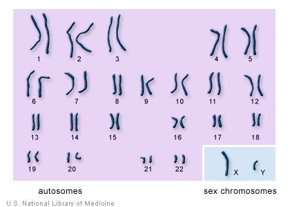
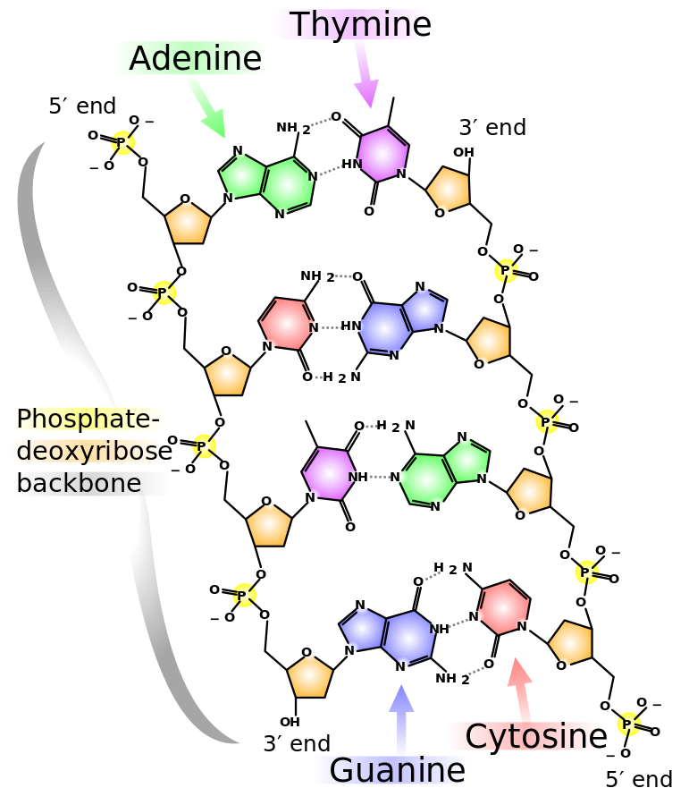
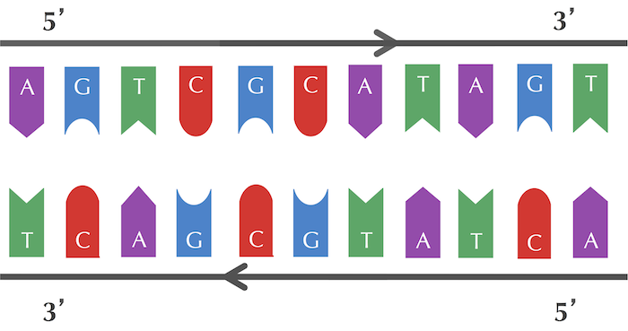

---
# You don't need to edit this file, it's empty on purpose.
# Edit theme's home layout instead if you wanna make some changes
# See: https://jekyllrb.com/docs/themes/#overriding-theme-defaults
layout: page
category: "notes"
course: "hemn115"
title:  "Week 7: Introduction to Bioinformatics"
year: "2019"
by: "Eslam"
---

* TOC
{:toc}

## Bioinformatics

Cell is the basic structural, functional and biological unit of all known living organisms. 


Cell nuclei contains cell's genetic materials DNA and RNA that forms the chromosomes. Human has 23 pairs of chromosomes. Genome is distributed along these chromosomes.




DNA stands for Deoxyribonucleic acids. DNA has two strands of four types of nucleotides.


* Adenine (A)
* Guanine (G)
* Cytosine (C)
* Thymine (T)
  
The two polymers are complementary to each other.





## Genome Data
This is how gnome data looks like


## Genome replication

Genome replication basically is to copy or make a clone of the gnome. Like copying that text but it is not for one time it is for million of times. Gnome replication is a complex process and till now it is not fully understood by the biologists. 


Dna Replication 

<iframe width="700" height="415" src="https://www.youtube.com/embed/TNKWgcFPHqw" frameborder="0" allow="accelerometer; autoplay; encrypted-media; gyroscope; picture-in-picture" allowfullscreen></iframe>

Finding replication origin is a key for many applications gene therapy, genetic modified food like frost-resistant tomatoes and [ pesticide-resistant corn](http://www.genewatch.org/sub-568238)

The idea of gene therapy simply is to infect patient who lack a specific gene with artificial gene that encode a therapeutic protein. Once become inside the cell it will be replicated and treat the patient.  
First human gene therapy experiment [link](https://history.nih.gov/exhibits/genetics/sect4.htm)


So where is engineering here. It is purely biological problem.  Only biologist can find experimentally the origin of replication. Simply he could cut cell DNA to pieces and find which piece will make the cell stop replication and hence it must be the origin of replication.

**It is not well defined computational problem**

## Hidden message in Replication origin

[The Gold-Bug](https://en.wikipedia.org/wiki/The_Gold-Bug) short story tells us about a hidden message of pirate treasures. This message must be encoded to be understood. 

 

 It was noticed that ;48 sequence is frequently repeated in that message, given that it is encoded from english and the most frequent word in english is THE we can replace ; with T, 4 with H, and 8 with E. 

  

 We have a better chance now to encode the message

 

So frequent word is the hidden message for decoding.

### Counting words 

So the first problem we need to solve is to count number of repetitions of a pattern in the text. 

```python
PatternCount(Text, Pattern)
        count ← 0
        for i ← 0 to |Text| − |Pattern|
            if Text(i, |Pattern|) = Pattern
                count ← count + 1
        return count

PatternCount("GCGCG", "GCG")
> Output
2
```

**Lets try to implement it**
### Getting Started with Python

Python is interpreted high level programming language for general purpose computing. 

You already installed anaconda. We can use spyder IDE to run our code, but we will use jupyter notebook.


### Variables

Python is untyped language 

```python
x = 5
y = 'Hello SBME'
```

### Lists

```python
# Initialize the list
myList = [2, 55, 565]

# add an element at the end of the list
myList.append(8)

# Add element in specific index
myList.insert(1, 7)

print( myList ) # ??
print( myList[0] ) # ??
print( myList[3] ) # ??
print( myList[4] ) # ??
```


### Arithmetic Operations

```python

x = 19
y = 18 

z = x / y
z = x * y
z = x + y
z = x - y

```

### Comparison Operators

operator | meaning
---|---
==	|Equal to
!=	|Not equal to
<	|Less than
>	|Greater than
<=	|Less than or equal to
>=	|Greater than or equal to


### Logical Operations

```python
x = True
y = False 

x or y 
x and y 
not x 
```

### If, elif, else

```python 

x = 25 
y = 20 

if x < y:
    print("y is greater than x")
elif x == y:
    print("x and y are equal")
else:
    print("x is greater than y")
```

### Loops

```python

for i in range(10):
  print( i )

i = 0
while i < 10 :
  print( i )
  i += 1
```


### Functions

```python
def mean( list ):
  sum = 0
  for element in list:
    sum += element
  return sum / len( list )

m = mean([1,12,42,1,23,12])
print( m )
```


### Importing Libraries

```python 
import numpy as np
```

### Frequent words

Given a text find frequent words with a specific length k.

```python
        FrequentWords(Text, k)
            FrequentPatterns ← an empty set
            for i ← 0 to |Text| − k
                Pattern ← the k-mer Text(i, k)
                Count(i) ← PatternCount(Text, Pattern)
            maxCount ← maximum value in array Count
            for i ← 0 to |Text| − k
                if Count(i) = maxCount
                    add Text(i, k) to FrequentPatterns
            remove duplicates from FrequentPatterns
        return FrequentPatterns
FrequentWords("ACGTTGCATGTCGCATGATGCATGAGAGCT", 4)
> Output
CATG GCAT
```

### Reverse complement 


Given a text of DNA string get its reverse complement

```python
    def reverseComplement(Text):
        complementDict = {}
        complementDict["A"] = "T"
        complementDict["C"] = "G"
        complementDict["G"] = "C"
        complementDict["T"] = "A"
        reverseComplement = "" # an empty string
        for i in reversed(Text):
            reverseComplement = reverseComplement +  complementDict[i]
        return reverseComplement

reverseComplement("AAAACCCGGT")
> Output
ACCGGGTTTT        
```

## Useful links 


[Finding Hidden Messages in DNA (Bioinformatics I)  ](https://www.coursera.org/learn/dna-analysis)

Online course [link](http://www.hcbravo.org/cmsc423/calendar/)


